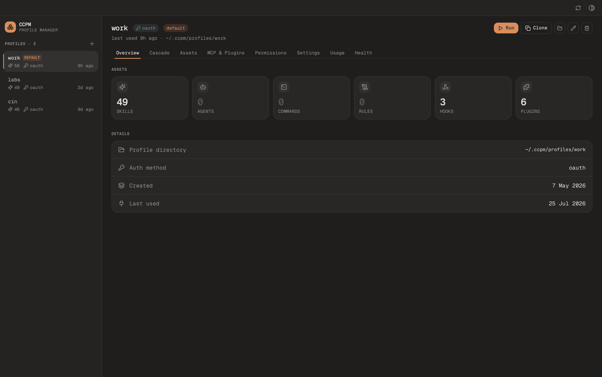
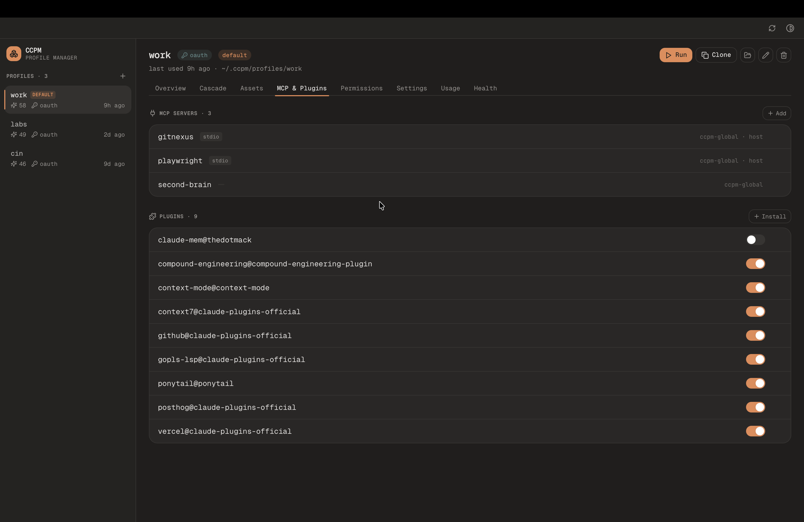

# ccpm

**Run multiple Claude Code accounts in parallel. Fully isolated. One command.**

[](https://github.com/nitin-1926/claude-code-profile-manager/actions/workflows/ci.yml)
[](https://www.npmjs.com/package/@ngcodes/ccpm)
[](LICENSE)

ccpm (Claude Code Profile Manager) lets you keep multiple isolated Claude Code profiles on one machine. Each profile has its own credentials, settings, MCP servers, plugins, skills, and memory. Open two terminals, run two different accounts at the same time.

## Why

Claude Code reads its config from a single directory (`~/.claude`). Without ccpm you can only be signed into one account at a time and switching means logging out, swapping files, or both.

ccpm gives every profile its own config directory and sets `CLAUDE_CONFIG_DIR` to it when you launch claude. Two terminals, two profiles, zero conflicts.

## Install

```bash
# npm
npm i -g @ngcodes/ccpm

# curl (macOS / Linux)
curl -fsSL https://raw.githubusercontent.com/nitin-1926/claude-code-profile-manager/main/scripts/install.sh | sh

# go
go install github.com/nitin-1926/claude-code-profile-manager/ccpm@latest
```

**Prefer a GUI?** Download the native macOS **desktop app** from the [desktop releases →](https://github.com/nitin-1926/claude-code-profile-manager/releases?q=desktop-v&expanded=true) — Apple Silicon or Intel `.dmg`. See [Desktop app](#desktop-app-optional) below. (The desktop app still uses the `ccpm` CLI for write actions, so install one of the above too.)

## Quick start


```bash
# Create profiles (each prompts for OAuth or API key)
ccpm add personal
ccpm add work

# Run them in parallel
ccpm run personal    # terminal 1
ccpm run work        # terminal 2

# See what you have
ccpm list
```

Sample output:

```text
NAME       AUTH      STATUS
personal   oauth     ✓ nitin@gmail.com
work       api_key   ✓ sk-ant-...7f2k   ★
```

### Migrating your existing `~/.claude`

If you already use Claude Code, your first profile doesn't have to start empty. When `~/.claude` exists, the `ccpm add` wizard offers to **import your current config** — skills, MCP servers, hooks, agents, commands, rules, and settings all carry over into the new profile.

```bash
# the wizard prompts: start empty, import from ~/.claude, or clone a profile
ccpm add personal
```

To do it explicitly (or to pull in changes you made to `~/.claude` later), run `ccpm import default` — see the [Import](#import) section for `--only`, `--all`, and dry-run flags.

## Changelog

Release notes live on the docs site: **[ccpm.dev/changelog](https://ccpm.dev/changelog)**.

## Key features

- **Parallel sessions**: run different Claude Code accounts side-by-side, fully isolated.
- **OAuth + API key** per profile, with credentials in the OS keychain.
- **Per-profile assets**: skills, agents, commands, rules, hooks, plugins, MCP servers, and settings install globally, per-profile, or per-project.
- **MCP transports**: stdio, HTTP, and SSE. Remote MCPs authenticate via `ccpm mcp auth` so OAuth tokens land in the right profile.
- **Permissions and hooks** without hand-editing JSON.
- **Transparent arg forwarding**: unknown flags after `ccpm run <profile>` flow through to claude with no `--` separator.
- **IDE default**: `ccpm set-default` pins a profile for direct `claude` launches (VS Code, Cursor, Antigravity, any GUI extension). On macOS this is set system-wide via a LaunchAgent.
- **Encrypted vault**: AES-256-GCM credential backups with a master key in your OS keychain.
- **Shared store**: directory-based assets are symlinked from `~/.ccpm/share/` into profiles for deduplication.
- **macOS is the verified platform** today. Linux and Windows builds compile and ship; OAuth `set-default`, `auth backup/restore`, and keychain-based `status` on those platforms are experimental until verified on real hardware.

## Desktop app (optional)

A native desktop GUI for managing profiles lives in [`ccpm/desktop/`](ccpm/desktop). It's built with [Wails](https://wails.io) (Go + native webview) in the same module as the CLI — so it reuses ccpm's own engine for reads and shells out to the `ccpm` CLI for writes (same locking, keychain, and validation). Local-first, no signup.

It gives you a left sidebar of profiles and, per profile, tabs for **Overview**, **Cascade** (the effective host→global→profile config with provenance badges and shadow/override hints), **Assets**, **MCP & Plugins**, **Permissions** (rules, mode, env), **Usage** (an amber token-usage dashboard mirroring `ccpm usage`), and **Health** (`ccpm doctor`). Clone / rename / delete / open / run profiles from the toolbar; the view auto-refreshes when the CLI changes things underneath it. Creating a profile or importing `~/.claude` opens a Terminal running the `ccpm add` wizard (in-GUI sign-in is on the roadmap).

<p align="center">
  
  <br>
  <em>Overview — every profile's assets at a glance.</em>
</p>

<p align="center">
  
  <br>
  <em>MCP &amp; Plugins — manage servers and toggle plugins per profile.</em>
</p>

### Download (macOS)

Grab the build for your Mac from the **[desktop releases →](https://github.com/nitin-1926/claude-code-profile-manager/releases?q=desktop-v&expanded=true)**: **Apple Silicon** (`CCPM-<version>-arm64.dmg`) or **Intel** (`CCPM-<version>-amd64.dmg`). Each is ~3–4 MB.

Open the `.dmg` and drag **CCPM** into **Applications**. The app is distributed unsigned (no Apple Developer account), so on first launch macOS Gatekeeper asks you to approve it once — **right-click the app → Open** (or **System Settings → Privacy & Security → "Open Anyway"**). It opens normally after that.

**Updates are automatic.** When a new version ships, the app shows an in-app **Update now** prompt, downloads it, and swaps itself in place — no re-downloading, no re-dragging, and no repeat of the Gatekeeper step. The desktop app versions independently of the CLI (released on `desktop-v*` tags).

The app uses the `ccpm` CLI for write actions — install it first if you haven't (see [Install](#install) for the go / npm / curl options).

### Build from source

```bash
go install github.com/wailsapp/wails/v2/cmd/wails@latest   # one-time: the Wails CLI

cd ccpm
make desktop       # builds desktop/build/bin/CCPM.app
make desktop-dev   # hot-reload dev window
```

## Commands

### Profile lifecycle

| Command                       | Description                                                                              |
| ----------------------------- | ---------------------------------------------------------------------------------------- |
| `ccpm add <name>`             | Create a new profile (interactive: import wizard + OAuth or API key)                     |
| `ccpm run <name> [...]`       | Launch Claude Code with a profile. Unknown flags forward to claude.                      |
| `ccpm use <name>`             | Set the profile for the current shell session (requires `ccpm shell-init`)               |
| `ccpm list` / `ls`            | List profiles with auth status (`--json` for machine-readable output)                    |
| `ccpm status [name]`          | System overview, or auth health for one profile (`--json`)                               |
| `ccpm rename <old> <new>`     | Rename a profile (migrates keychain entries and plugin paths)                            |
| `ccpm remove <name>` / `rm`   | Delete a profile (`--force` to skip confirm)                                             |
| `ccpm clone <src> <new>`      | Duplicate a profile (assets + settings + auth; `--no-auth` for assets only)              |
| `ccpm set-default [name]`     | Pin the default profile for direct `claude` launches; macOS sets it system-wide          |
| `ccpm unset-default`          | Clear the default                                                                        |
| `ccpm prompt`                 | Print the active profile name for a shell prompt (PS1 / starship / p10k)                 |
| `ccpm statusline`             | Render the in-TUI status line (active profile + usage/limits); Claude Code calls it      |
| `ccpm sync`                   | Re-apply global installs into one or all profiles (`--dry-run` to preview)               |
| `ccpm doctor`                 | Health check: env, auth, drift, symlinks, cascade (`--fix` prunes dangling symlinks)     |
| `ccpm consolidate`            | Audit (and optionally `--fix`) asset drift across host, share, and profile scopes        |
| `ccpm export <name>`          | Export a profile to a portable `.tar.gz` (credentials excluded by default)               |
| `ccpm import-bundle <file>`   | Restore a profile from an export bundle                                                  |
| `ccpm shell-init`             | Print the shell hook (auto-detects zsh / bash / fish / powershell)                       |
| `ccpm completion <shell>`     | Generate a shell completion script (bash / zsh / fish / powershell)                      |
| `ccpm uninstall`              | Remove all profiles, keychain entries, vault backups, and `~/.ccpm/`                     |
| `ccpm version`                | Print the version; `--check-latest` checks GitHub for a newer release (opt-in, 24h cache)|
| `ccpm diff <a> <b>`           | Compare two profiles (assets, settings keys, env names, MCP servers, plugins)           |

Every command also accepts the global `--log-level debug|info|warn|error` flag (default `warn`); `debug` traces cascade adoption and lock activity to stderr.

`ccpm run` intercepts five flags before forwarding to claude: `--ccpm-env KEY=VAL` (one-shot env override, repeatable), `--no-auto-adopt` (skip the host-asset cascade scan for this launch), `--no-statusline` (skip injecting the default status line for this launch), `--help`, `--version`. Use `--` to forward `--help` or `--version` to claude.

### Assets: skills, agents, commands, rules

All four share the same command shape. Replace `skill` with `agent`, `command`, or `rule`.

| Command                                 | Description                                |
| --------------------------------------- | ------------------------------------------ |
| `ccpm skill add <path> --global`        | Install for every profile                  |
| `ccpm skill add <path> --profile <p>`   | Install for one profile                    |
| `ccpm skill remove <name> --global`     | Remove from every profile (alias `rm`)     |
| `ccpm skill link <name> --profile <p>`  | Link a shared asset into a profile         |
| `ccpm skill list`                       | List installed (alias `ls`)                |

Source may be a directory (skills require a `SKILL.md` marker) or a single file (agents/commands/rules are usually `.md`). Pass `--live-symlink` to keep the source linked so edits show up live, or `--copy` to snapshot it.

### Plugins

ccpm installs plugins itself, end-to-end, without a Claude Code session. Marketplaces clone into a shared store, plugin files cache once and symlink into each profile, and per-profile activation lives in the same settings fragment ccpm uses for everything else.

| Command                                                            | Description                                                  |
| ------------------------------------------------------------------ | ------------------------------------------------------------ |
| `ccpm plugin marketplace add <org>/<repo>`                         | Clone a marketplace (HTTPS default; `--ssh` to use `git@`)   |
| `ccpm plugin marketplace list` / `remove <name>`                   | Inspect or drop a marketplace                                |
| `ccpm plugin install <name>@<marketplace> --global`                | Install into every profile and enable                        |
| `ccpm plugin install <name>@<marketplace> --profile <p>`           | Install into one profile only                                |
| `ccpm plugin install ... --install-only`                           | Install without enabling                                     |
| `ccpm plugin remove <name>@<marketplace> --global` / `--profile`   | Remove the plugin from every profile or just one             |
| `ccpm plugin list [--profile <p>]`                                 | Show installed plugins + per-profile enabled state           |
| `ccpm plugin enable / disable <name>@<marketplace> --profile <p>`  | Toggle activation                                            |
| `ccpm plugin gc`                                                   | Drop unreferenced shared-cache entries (also part of `sync`) |

Plugin clones default to HTTPS so an `https://github.com/<org>/<repo>.git` URL works without an SSH key. If you prefer SSH, pass `--ssh`.

### Hooks

| Command                                              | Description                              |
| ---------------------------------------------------- | ---------------------------------------- |
| `ccpm hooks add <event> "<cmd>" --profile <p>`       | Append a hook to an event                |
| `ccpm hooks add <event> "<cmd>" --matcher <regex>`   | Restrict to a tool-name pattern          |
| `ccpm hooks remove <event> --profile <p> [--index]`  | Remove the last entry, or one by index   |
| `ccpm hooks list --profile <p>`                      | Show merged hooks for a profile          |

Events: `PreToolUse`, `PostToolUse`, `UserPromptSubmit`, `SessionStart`, `SessionEnd`, `Notification`, `Stop`, `SubagentStop`, `PreCompact`. Hook shell scripts in `~/.claude/hooks/` are managed separately via `ccpm import default --only hooks`.

### MCP servers

| Command                                                                | Description                                          |
| ---------------------------------------------------------------------- | ---------------------------------------------------- |
| `ccpm mcp add <name> --scope global --command <cmd>`                   | Stdio MCP for every profile (ccpm global fragment)   |
| `ccpm mcp add <name> --scope profile --profile <p> --command <cmd>`    | Stdio MCP for one profile                            |
| `ccpm mcp add <name> --scope project --command <cmd>`                  | Stdio MCP in the current repo's `.mcp.json`          |
| `ccpm mcp add <name> --transport http --url <url> [--header K=V]`      | Remote HTTP MCP                                      |
| `ccpm mcp add <name> --transport sse --url <url>`                      | SSE MCP                                              |
| `ccpm mcp auth <name> --profile <p>`                                   | Complete OAuth in the profile's scope                |
| `ccpm mcp remove <name> --scope <global\|profile\|project>`            | Remove a server                                      |
| `ccpm mcp import <file.json> --scope ...`                              | Import from a JSON file (`{mcpServers:{...}}`)       |
| `ccpm mcp list`                                                        | List MCPs with source (`--json` supported)            |

`--global` and `--profile <name>` are accepted as aliases for `--scope global` / `--scope profile`. For `--scope project`, ccpm discovers the project root by walking up from CWD looking for `.claude/settings.json`, `.claude/settings.local.json`, or `.mcp.json`, or pass `--project-dir <path>` explicitly.

### Permissions

`ccpm permissions` manages `permissions.{allow,ask,deny,defaultMode}` in the profile fragment (or with `--global`, in `~/.claude/settings.json`). Adding to one bucket removes from the other two so the lists stay disjoint.

| Command                                                                                          | Description                       |
| ------------------------------------------------------------------------------------------------ | --------------------------------- |
| `ccpm permissions allow "Bash(git status:*)" --profile <p>`                                      | Add to `permissions.allow`        |
| `ccpm permissions ask "Edit(**/*.md)" --profile <p>`                                             | Add to `permissions.ask`          |
| `ccpm permissions deny "Bash(rm:*)" --profile <p>`                                               | Add to `permissions.deny`         |
| `ccpm permissions remove "<rule>" --profile <p>`                                                 | Strip from all three              |
| `ccpm permissions list --profile <p>`                                                            | Show all rules + the default mode |
| `ccpm permissions mode <default\|acceptEdits\|plan\|auto\|dontAsk\|bypassPermissions> --profile <p>` | Set `permissions.defaultMode`     |

### Trust

A new repo's `.claude/settings.json` (hooks, permissions, MCP) is ignored until you grant trust to that directory.

| Command                       | Description                                                  |
| ----------------------------- | ------------------------------------------------------------ |
| `ccpm trust add [path]`       | Grant trust (defaults to CWD). Alias: `grant`                |
| `ccpm trust remove [path]`    | Revoke trust. Aliases: `rm`, `forget`, `revoke`              |
| `ccpm trust list`             | List trusted directories. Alias: `ls`                        |

### Environment variables

`ccpm env` persists env vars on a profile; they are layered into the process env at every `ccpm run`, below the parent process env and `--ccpm-env`.

| Command                                                | Description                          |
| ------------------------------------------------------ | ------------------------------------ |
| `ccpm env set KEY=VALUE [KEY=VALUE...] --profile <p>`  | Persist env vars on the profile      |
| `ccpm env unset KEY [KEY...] --profile <p>`            | Remove env vars                      |
| `ccpm env list --profile <p>`                          | List persisted env vars              |
| `ccpm run <p> --ccpm-env KEY=VALUE` (repeatable)       | One-shot env override at launch time |

`CLAUDE_CONFIG_DIR` and `ANTHROPIC_API_KEY` are reserved: ccpm always computes them and they cannot be set via `ccpm env`. Use `--ccpm-env` for a one-shot override.

### Sessions

| Command                              | Description                                                                |
| ------------------------------------ | -------------------------------------------------------------------------- |
| `ccpm sessions list <profile>`       | Sessions scoped to the current working directory (`--limit N`, `--json`)    |
| `ccpm sessions list <profile> --all` | Sessions from every project the profile has worked on                      |

### Import

| Command                                            | Description                                                                    |
| -------------------------------------------------- | ------------------------------------------------------------------------------ |
| `ccpm import default --profile <p>`                | Interactive: import skills/commands/hooks/agents/rules/settings/MCP/plugins    |
| `ccpm import default --all --only skills`          | Non-interactive: import specific targets into every profile                    |
| `ccpm import default --profile <p> --no-share`     | Copy directly instead of symlinking from the shared store                      |
| `ccpm import from-profile --src <a> --profile <b>` | Clone assets from one ccpm profile into another                                |

`--only` accepts a comma-separated list of: `skills`, `commands`, `rules`, `hooks`, `agents`, `settings`, `mcp`, `plugins`.

### Backup & migrate profiles

`ccpm export` bundles a profile's directory — skills, agents, commands, rules, hooks, MCP fragments, plugin metadata, and settings — into a single `.tar.gz` you can copy to another machine and restore with `ccpm import-bundle`. `ccpm clone` duplicates a profile in place.

| Command                                            | Description                                                                              |
| -------------------------------------------------- | ---------------------------------------------------------------------------------------- |
| `ccpm export <name> [-o file.tar.gz]`              | Export a profile to a portable bundle (credentials **excluded** by default)              |
| `ccpm export <name> --include-credentials`         | Include credential files (sensitive — trusted same-user moves only)                      |
| `ccpm import-bundle <file.tar.gz> [--profile <p>]` | Restore a profile from a bundle (path-traversal-safe; `--profile` overrides the name)    |
| `ccpm clone <src> <new>`                           | Duplicate a profile, copying assets, settings, and credentials                           |
| `ccpm clone <src> <new> --no-auth`                 | Clone assets/settings only; leave the new profile unauthenticated                        |

Credentials are NOT included in an export by default: OS-keychain tokens are machine-bound, and `.credentials.json` / `.claude.json` hold secrets you usually don't want in a shareable file. Use `--include-credentials` only for a trusted same-user move (e.g. a Linux machine migration). When a restored or cloned profile has no credentials, authenticate it afterward with `ccpm auth refresh <name>`.

> **OAuth clone caveat**: a cloned OAuth profile shares the source account's tokens, so when Claude rotates the refresh token in one, the other goes stale. For a clone you'll use long-term against the same account, prefer `--no-auth` and run `ccpm auth refresh <new>` to give it its own login. API-key clones have no such caveat.

### Shell completion

`ccpm completion <shell>` prints a completion script for `bash`, `zsh`, `fish`, or `powershell`, with completion for profile names on `run` / `use` / `remove` / `rename` / `set-default` / `clone` / `export`.

```bash
# zsh: load on every new shell
echo 'source <(ccpm completion zsh)' >> ~/.zshrc

# bash
echo 'source <(ccpm completion bash)' >> ~/.bashrc

# fish
ccpm completion fish > ~/.config/fish/completions/ccpm.fish
```

Run `ccpm completion <shell> --help` for the per-shell install details.

### Shell prompt

`ccpm prompt` prints the active profile name so you can show which Claude Code account a terminal is bound to. It resolves `$CCPM_ACTIVE_PROFILE` (set by `ccpm use`), then `$CLAUDE_CONFIG_DIR`, then — only with `--show-default` — the configured default. It prints nothing (exit 0) when no profile is active, so it stays quiet in non-ccpm shells.

```bash
# bash/zsh PS1
PS1='$(ccpm prompt --format "[ccpm:%s] ")'"$PS1"

# starship custom command
command = "ccpm prompt"
```

### Status line (which profile is running, plus usage/limits)

Where `ccpm prompt` feeds your **shell** prompt, `ccpm statusline` feeds the **Claude Code TUI** — a line pinned to the bottom of the session window showing which profile is active and how much you've used:

```
⬢ work · Sonnet 4.6 · ctx 34% · 5h 58% ↺16:15 · 7d 88% · $1.23
```

The `5h` / `7d` segments are the **remaining** percentage of your rolling subscription usage windows (Claude Pro/Max only — Claude Code supplies them; they appear after the first response and are absent for API-key profiles, which show just `⬢ work · Opus 4.8 · $0.12`).

`ccpm run` wires this in automatically: when a profile has no `statusLine` of its own, it injects `ccpm statusline` as the profile's status line. It **never** overwrites a status line you set in `~/.claude/settings.json`, a profile, or a trusted project. To opt out:

```bash
ccpm config set statusline false          # persistently, all profiles
ccpm run work --no-statusline             # just this launch
ccpm settings statusline "" --profile work  # remove one ccpm already injected
```

### Settings

ccpm does not maintain its own global settings layer. The cross-profile baseline is `~/.claude/settings.json` (the file native Claude Code reads); ccpm merges it into every profile at launch. Use `--profile` for per-account overrides, and per-repo `.claude/settings.json` for project overrides.

| Command                                            | Description                                                                                  |
| -------------------------------------------------- | -------------------------------------------------------------------------------------------- |
| `ccpm settings set <key> <value> --profile <p>`    | Set a setting for one profile (dot notation, JSON values)                                    |
| `ccpm settings get <key> --profile <p>`            | Read the effective value                                                                     |
| `ccpm settings apply <file.json> --profile <p>`    | Deep-merge a JSON fragment                                                                   |
| `ccpm settings show --profile <p>`                 | Dump the fully-merged settings                                                               |
| `ccpm settings statusline "<cmd>" --profile <p>`   | Set the native `statusLine` block. Empty `""` removes it.                                    |
| `ccpm settings outputstyle <style> --profile <p>`  | Set `outputStyle` (allowlist: default, Build, Explanatory, Learning, Direct)                 |

### Authentication

| Command                    | Description                                |
| -------------------------- | ------------------------------------------ |
| `ccpm auth status`         | Credential validity across profiles        |
| `ccpm auth refresh <name>` | Re-authenticate a profile                  |
| `ccpm auth backup <name>`  | Create an encrypted credential backup      |
| `ccpm auth restore <name>` | Restore credentials from backup            |

### Drift fingerprint

`ccpm import default` snapshots the files under `~/.claude` it touched. Later you can ask whether the host config has drifted:

| Command                              | Description                                                |
| ------------------------------------ | ---------------------------------------------------------- |
| `ccpm default fingerprint update`    | Record the current `~/.claude` state as the baseline       |
| `ccpm default fingerprint check`     | Diff `~/.claude` against the baseline; suggests `import`   |
| `ccpm config set check_default_drift true`  | Show drift notifications on `ccpm run` / `ccpm use` |

### Config

| Command                                            | Description                                  |
| -------------------------------------------------- | -------------------------------------------- |
| `ccpm config set cascade_auto_adopt false`         | Disable the host-asset cascade               |
| `ccpm config set check_default_drift true`        | Enable drift notifications on run/use        |
| `ccpm config set statusline false`                 | Disable default status-line auto-injection   |
| `ccpm config get default_dir`                      | Print the default profile's absolute path    |

### Exit codes

For scripting: `0` success (warnings may print to stderr but never change the
exit code), `1` command failed, `3` partial failure (`ccpm import` landed some
targets but at least one step failed), `4` `ccpm doctor` found health issues.

## How it works

`ccpm run <profile>` materializes the profile (merges settings + MCP fragments, links host-cascaded assets), sets `CLAUDE_CONFIG_DIR` to the profile dir, and execs `claude`. Each terminal gets a completely isolated Claude Code instance. No daemons, no patches.

### Asset resolution (higher wins)

1. **Project**: `<repo>/.claude/<asset>/` and `<repo>/.claude/settings.json`. Native Claude Code's loader already gives this priority.
2. **Profile**: assets installed via `ccpm <asset> add --profile <name>`.
3. **Global**: assets installed via `ccpm <asset> add --global` (live in `~/.ccpm/share/`).
4. **Host cascade**: anything in `~/.claude/<asset>/` (a `/plugin install` inside a session, `npx skills add`, manual edits) auto-adopts into every profile at launch. Opt out with `ccpm config set cascade_auto_adopt false` or `--no-auto-adopt` on `run` / `sync`. Profile-local always wins over host; `ccpm doctor` flags shadowed names.

### Settings merge order (lowest to highest)

1. The profile's existing `<profile>/settings.json` (preserves keys Claude wrote itself).
2. `~/.claude/settings.json` (shared baseline; edit directly to change every profile).
3. `~/.ccpm/share/settings/<profile>.json` (ccpm per-profile fragment).
4. Owned-keys sidecar (values explicitly set via `ccpm settings set --profile`; protects them from being silently overwritten).
5. `./.claude/settings.json` at the project root.
6. `./.claude/settings.local.json` at the project root (gitignored local overrides).
7. Enterprise managed-settings (`/Library/Application Support/ClaudeCode/managed-settings.json` on macOS; `/etc/claude-code/managed-settings.json` on Linux; `C:\ProgramData\ClaudeCode\managed-settings.json` on Windows; plus `managed-settings.d/*.json` drop-ins merged alphabetically). Highest precedence so org policy always wins.

MCP merge order: host `~/.claude.json#mcpServers` → ccpm global fragment → ccpm profile fragment → project `.claude/settings.json#mcpServers` → project `.mcp.json` → managed `mcpServers`.

Objects merge key-by-key; arrays and scalars from a higher-precedence source replace the lower one.

### Directory layout

```
~/.ccpm/
├── config.json          # profile registry; cascade_auto_adopt, check_default_drift
├── installs.json        # manifest of installed assets (skill/agent/command/rule/hook/mcp/plugin)
│                          # entries carry scope: global | profile | host
├── share/
│   ├── skills/          # shared skills (symlinked into profiles)
│   ├── agents/ commands/ rules/ hooks/
│   ├── mcp/             # MCP fragments: global.json + <profile>.json
│   └── settings/        # per-profile settings fragments
├── profiles/
│   ├── personal/        # CLAUDE_CONFIG_DIR for "personal"
│   └── work/
└── vault/               # encrypted credential backups
```

## Privacy and security

ccpm is 100% local. It never makes network requests, collects data, or phones home.

- API keys live in the OS keychain (macOS Keychain, Linux Secret Service, Windows Credential Manager).
- Vault backups use AES-256-GCM with a master key in your OS keychain.
- All data lives in `~/.ccpm/`. No telemetry, no analytics, no tracking.

## Platform support

> **macOS is the verified platform today.** Linux and Windows builds compile, install, and run, but the OAuth-isolation paths (`set-default`, `auth backup/restore`, keychain-based `status`) are **experimental** until exercised against a real Linux Secret Service or Windows Credential Manager install.

| Feature            | macOS ✓ verified                         | Windows ⚠ experimental                                | Linux ⚠ experimental |
| ------------------ | ---------------------------------------- | ----------------------------------------------------- | -------------------- |
| OAuth per-profile  | Keychain entry namespaced by profile dir | wincred entry namespaced by profile dir (theoretical) | `.credentials.json`  |
| API key storage    | Keychain                                 | Credential Manager                                    | Secret Service       |
| Parallel sessions  | Yes                                      | Yes                                                   | Yes                  |
| Shared asset dedup | Symlinks                                 | Symlinks (Developer Mode) or copy[^1]                 | Symlinks             |
| Shell hook         | zsh, bash, fish                          | PowerShell                                            | zsh, bash, fish      |
| `set-default` (system-wide GUI) | LaunchAgent + `launchctl setenv` | Keychain / identity only                | Keychain / identity only |

[^1]: Without Developer Mode or admin, Windows cannot create symlinks; ccpm falls back to copying and writes a marker at `~/.ccpm/.windows-copy-fallback`. Turn on Developer Mode for true deduplication.

> Requires **Claude Code v2.1.56+** on macOS for OAuth isolation. Earlier versions share a single keychain entry across profiles. `ccpm doctor` warns when your Claude Code is too old.

## MCP authentication model

How an MCP server authenticates determines whether ccpm can isolate it per profile.

1. **Env-var MCPs** (e.g. `GITHUB_TOKEN`): isolated. Stored in the per-profile fragment at `~/.ccpm/share/mcp/<profile>.json`. Configure with `ccpm mcp add <name> --env KEY=VALUE --profile <p>`.
2. **OAuth MCPs** (open a browser, cache tokens in `.claude.json#mcpOAuth`): isolated, because `CLAUDE_CONFIG_DIR` is per-profile.
3. **Globally-cached MCPs** (servers that write to `~/.config/<service>` or a non-namespaced OS keychain entry): **shared across profiles**. ccpm cannot isolate them without cooperation from the server.

## Known limitations

- **IDE extensions ignore `CLAUDE_CONFIG_DIR`**: VS Code, Cursor, and Antigravity launch claude directly without going through a shell. Use `ccpm set-default <profile>` to pin one for them. On macOS this is system-wide via a LaunchAgent; on Linux and Windows the keychain and identity sync apply but the system-wide env mechanism is not yet implemented (terminal use is covered by `ccpm shell-init`).
- **Headless Linux**: `go-keyring` requires D-Bus and a secret service (gnome-keyring or kwallet). API-key profiles on headless servers need a running secret service.
- **Globally-cached MCP servers** cannot be isolated per profile (see the MCP auth section).

## Troubleshooting / FAQ

### `/plugin install` fails with `git@github.com: Permission denied (publickey)`

Claude Code clones plugin marketplaces over SSH by default. If you authenticate over HTTPS only, force git to rewrite SSH URLs to HTTPS:

```sh
git config --global url."https://github.com/".insteadOf "git@github.com:"
```

This applies to every tool that uses git.

### "Keychain access denied" / repeated keychain prompts

ccpm stores credentials in the OS keychain (macOS Keychain, Linux Secret Service, Windows Credential Manager). If access is denied, allow `ccpm` (and `claude`) to read the relevant keychain items when prompted. On macOS you can inspect the namespaced entry name via `ccpm doctor`.

### "Claude Code too old (needs 2.1.56+)" on macOS OAuth

Per-profile OAuth isolation on macOS needs Claude Code v2.1.56+ (older builds share a single keychain entry across profiles). Run `ccpm doctor` to see your installed version, then update Claude Code.

### Broken or dangling symlinks

Run `ccpm doctor` to detect them, then `ccpm doctor --fix` to prune dangling shared-asset symlinks. For deeper asset drift across host, share, and profile scopes, use `ccpm consolidate --fix`.

### My IDE still uses the wrong account

After `ccpm set-default <profile>`, already-running IDE windows (VS Code, Cursor, Antigravity) need **one restart** to pick up the new `CLAUDE_CONFIG_DIR`. Future launches and logins are automatic.

### Running sessions don't see my change

`ccpm set-default`, `ccpm rename`, and `ccpm remove` don't affect already-running Claude Code sessions. Restart the session (and any IDE window) to pick up the change.

## Uninstall

`ccpm uninstall` removes every profile, deletes API keys from the OS keychain, wipes vault backups, and deletes `~/.ccpm/`. It does **not** remove the `ccpm` binary itself or the shell hook line you added to `~/.zshrc` / `~/.bashrc`. The command prints those cleanup steps so you can run them by hand.

```bash
# with confirmation prompt
ccpm uninstall

# skip the confirmation
ccpm uninstall --force
```

## Build from source

```bash
git clone https://github.com/nitin-1926/claude-code-profile-manager.git
cd claude-code-profile-manager/ccpm
go build -o ccpm .
./ccpm --version
```

## Releasing

`scripts/release.sh` handles the end-to-end release (bump, verify, tag, GitHub Release, npm publish) with preflight checks (git/go/node/npm/gh on PATH, on `main`, clean tree, in sync with `origin/main`, logged in to `gh` and npm, target tag unused). Run `./scripts/release.sh --help` for the full flag list (`patch`/`minor`/`major`/explicit version, `--dry-run`, `--stash`, `--allow-dirty`, `--skip-tests`, `--skip-npm`, `-y`).

## Contributing

Contributions welcome. Open an issue first to discuss what you want to change.

1. Fork the repo.
2. Create a feature branch (`git checkout -b feature/your-feature`).
3. Make your changes and run the tests (`cd ccpm && go test ./...`).
4. Open a pull request.

## License

MIT

## Author

Built by [Nitin Gupta](https://x.com/nitingupta__7).
