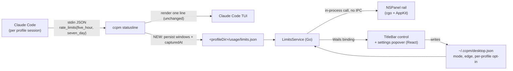

# feat: macOS usage rail — per-profile Claude limits in a floating edge panel

## Summary

Add a floating, always-on-top macOS rail that shows one circular progress ring per ccpm profile, with a hover callout detailing each Claude rate-limit window (used %, reset time). The numbers come from the `rate_limits` block Claude Code already hands `ccpm statusline` on every render — currently parsed, printed, and discarded. This plan persists that payload per profile, exposes it to the desktop app, and renders it in an `NSPanel` created via cgo, since Wails v2 cannot open a second window.

---

## Problem Frame

ccpm tracks token usage per profile but has no view of *subscription* limits — the 5-hour session window and 7-day window that actually gate a Claude Code user's work. Those numbers exist today only inside a running Claude Code TUI. A user juggling three profiles (`work`, `labs`, `cin`) has no way to see, at a glance, which account still has headroom, or when the one they just exhausted comes back.

The maintainer wants that answer visible without opening the app at all: a thin rail pinned to a screen edge near the notch, ring per profile, hover for detail — modelled on the Codenotch app, and expected to match or beat its design.

---

## Requirements

- R1. A floating rail, outside the main app window, showing one circular ring + percentage per enabled ccpm profile.
- R2. Hovering a ring reveals a callout: header (profile identity + data freshness), then one block per limit window — label, reset time, progress bar, "N% Used".
- R3. Limits and reset times must be **real**, sourced honestly. A percentage we cannot source is never fabricated.
- R4. Rings are profile-separated — each ccpm profile is a distinct Claude account with its own limits and reset clocks.
- R5. Rail visibility modes: Always show / Show on hover / Hide. Edge placement: Right / Left / Top / Bottom.
- R6. A control in the app toolbar toggles the rail and opens its settings.
- R7. Per-profile opt-in: each profile can be included in or excluded from the rail.
- R8. Premium visual quality with smooth hover animation, honoring the existing three themes (Graphite / Midnight / Light) and `prefers-reduced-motion`.
- R9. The rail survives the main window being closed, app switches, Space switches, and other apps going fullscreen.

---

## Scope Boundaries

- Claude Code only. No Cursor / Codex / Antigravity integrations (Codenotch's other rows).
- macOS only. Everything lands behind `//go:build darwin`; no Windows/Linux rail.
- No "launch at login" (Codenotch's Startup section) — deferred.
- No new npm dependency, and no motion library. CSS/AppKit animation only.
- The rail does **not** run when the app is fully quit. It is a panel in the app's process, not a background agent.

### Deferred to Follow-Up Work

- `/api/oauth/usage` live refresh (see Key Technical Decisions) — a later enrichment once the statusline path proves out.
- An `NSStatusItem` menu-bar extra as a "bring the app back" affordance, which becomes more valuable once `HideWindowOnClose` is on.
- Migration to Wails v3, which has native multi-window and `NSPanel` support (PR #6008, merged ~2026-08-21). Revisit at v3 stable.

---

## Context & Research

### The data source (resolves hard unknown #1)

Three candidate sources were investigated empirically:

| Source | Verdict |
|---|---|
| Transcripts (`~/.claude/projects/**/*.jsonl`) | **Nothing.** 7,698 lines in the largest transcript plus 400 files scanned: zero keys matching `limit` / `reset` / `quota` / `retry`. Only `message.usage.*` token counts. |
| `~/.claude.json` | Has `oauthAccount.organizationRateLimitTier` (e.g. `default_claude_max_5x`) and the account email — **identity and plan, but no consumption or reset data**. `~/.claude/policy-limits.json` is enterprise policy, unrelated. |
| Claude Code's statusline payload | **This is the answer.** |

`ccpm/cmd/statusline.go:32-44` already declares:

```go
RateLimits *struct {
    FiveHour *rateWindow `json:"five_hour"`
    SevenDay *rateWindow `json:"seven_day"`
} `json:"rate_limits"`

type rateWindow struct {
    UsedPercentage float64 `json:"used_percentage"`
    ResetsAt       int64   `json:"resets_at"`
}
```

Real percentages, real reset timestamps, first-party, [documented](https://code.claude.com/docs/en/statusline), arriving on stdin every time Claude Code renders the status line — and today thrown away after printing one line. `Settings.DefaultStatusLine` defaults **on**, so most profiles already receive this.

The existing comment on that struct records the honest caveat: `rate_limits` is present only for Claude.ai Pro/Max accounts and only after the first API response in a session; it is absent for API-key profiles. Locally, `cin` sits on tier `default_raven` and is expected to produce no windows at all.

### Relevant code and patterns

- `ccpm/internal/usage/store.go:132-137` — per-profile store at `<profileDir>/usage/` (`state.json`, `sessions.json`, `daily.json`, `.lock`). A new `limits.json` belongs here, reusing the atomic-write + advisory-lock conventions.
- `ccpm/desktop/services/usage.go` — service shape (`type UsageService struct{}` + `NewUsage()`), bound in `ccpm/desktop/main.go`'s `Bind` slice.
- **House rule** (verbatim from `ccpm/desktop/services/details.go`): return non-nil slices so JSON is `[]` not `null`; unknown profile returns a populated empty DTO with a `nil` error, never a hard error. `ccpm/desktop/services/nonnil_test.go` enforces this.
- `ccpm/desktop/frontend/src/components/ThemeToggle.tsx` — the only popover pattern in the codebase (`absolute … z-50 … bg-popover shadow-lg`, `role="menu"`, Escape/outside-click close, focus returned to trigger). The rail settings menu should mirror it.
- `ccpm/desktop/frontend/src/components/TitleBar.tsx` — the toolbar. New permanent controls go beside `<ThemeToggle/>`, inside the `--wails-draggable: no-drag` wrapper or the drag region swallows clicks.
- `ccpm/desktop/frontend/src/globals.css` — colour tokens (`--background`, `--card`, `--popover`, `--primary`, `--muted-foreground`, `--border`, `--destructive`, `--chart-1..5`) redefined per `data-theme`. All oklch. `--primary` is `oklch(0.7214 0.1337 49.9802)` in both dark themes.
- Existing linear-progress idiom (three copies, e.g. `ccpm/desktop/frontend/src/components/tabs/UsageTab.tsx`): `<div class="h-1.5 rounded-full bg-muted"><div class="h-full rounded-full bg-primary" style={{width}}/></div>`.

**Gaps confirmed to not exist:** no tooltip/popover component, no circular-progress component, no SVG anywhere in `src/`, no shared `Switch` (it is private inside `McpPluginsTab.tsx`), no motion library, no frontend test runner (`tsc --noEmit` is the only frontend CI gate).

### The window problem (resolves hard unknown #2)

Wails v2.12 **cannot** open a second window. Verified in the module cache: `pkg/runtime/window.go` has no window handle on any of its 30 functions; `internal/frontend/desktop/darwin/frontend.go:253` holds exactly one `mainWindow`; `NewWindow` is under `internal/` and unimportable. Upstream issue #1480 defers multi-window to v3, and the maintainer has stated extras like this will not land in v2.

So *some* cgo is unavoidable. Four options were weighed (native `NSPanel`; `NSPanel` hosting a `WKWebView`; a separate helper process; an `NSStatusItem`). See Key Technical Decisions.

Three landmines found in the Wails source that this plan must handle:

1. `WindowDelegate.m:16-22` — closing the main window today calls `processMessage("Q")` and **quits the process**. R9 forces `HideWindowOnClose: true`.
2. That path then calls `[NSApp hide:nil]`, which hides *every* window including our panel — requires `canHide = NO`.
3. `NSPanel` defaults `hidesOnDeactivate = YES` — the rail would vanish on every app switch unless explicitly `NO`.

And the main-thread hazard: `darwin/window.go` `init()` does `runtime.LockOSThread()`, pinning the main goroutine inside `[NSApp run]`, while `OnStartup` is dispatched on a *different* goroutine. **`app.startup` is not on the main thread.** Every AppKit call must go through `dispatch_async(dispatch_get_main_queue(), …)`; `dispatch_sync` to the main queue from the main thread deadlocks instantly.

---

## Key Technical Decisions

- **Data source: persist the statusline payload, don't call an API.** `ccpm statusline` already receives real windows. Persisting them costs one small write per render, needs no credentials, and touches no undocumented endpoint. *Rationale:* the alternative found in the Claude Code binary — `GET /api/oauth/usage` with the profile's OAuth bearer (fields `five_hour`, `seven_day`, `seven_day_opus`, `weekly_scoped`, `utilization`, `resets_at`) — is undocumented, requires reading tokens out of the keychain, and can break without notice. Deferred, not adopted.

- **Freshness is a first-class field, not a hidden flaw.** Statusline data is only as recent as that profile's last Claude Code render. The callout header therefore shows `updated 11 min ago`, exactly as the reference design does. This turns the constraint into honest UI rather than a stale number presented as live.

- **Absent data renders as absent.** For API-key or non-Pro/Max profiles (`cin` locally, tier `default_raven`), the ring draws as a muted track with an em-dash and the callout explains why. Never a 0% that reads as "plenty left". This is R3 made concrete.

- **Rail architecture: cgo + Objective-C `NSPanel`, native AppKit/CoreAnimation drawing.** *Rationale:* it is the smallest thing satisfying every requirement, and calls `LimitsService` directly in-process — zero IPC, zero serialization, no second copy of the data layer. The `WKWebView` variant would let the rail reuse React and Tailwind tokens directly, but costs an extra WebContent + GPU process (~50–100 MB RSS) permanently resident for a strip drawing a few arcs, plus a hand-rolled scheme handler (production darwin serves `wails://wails/` through Wails' own handler, unavailable to a second webview) and a hand-rolled JS bridge. Poor ratio for an always-on utility. A helper process is the only option that survives the app quitting, but doubles the codesign/notarize/auto-update surface — revisit only if that becomes a hard requirement.

- **Consequence accepted: the rail's pixels are AppKit, not Tailwind.** The three themes must be mirrored into the native layer. Handled by a single Go palette that maps each `data-theme` to the handful of oklch tokens the rail uses, converted to `NSColor` once and passed over cgo. One documented mapping table, not a second design system.

- **Panel configuration** (each flag load-bearing, per the landmines above):

  ```
  styleMask          = Borderless | NonactivatingPanel   // clicks without stealing focus
  level              = NSStatusWindowLevel (25)          // above the menu bar (24); Floating (3) is not enough near the notch
  collectionBehavior = CanJoinAllSpaces | Stationary | FullScreenAuxiliary
  hidesOnDeactivate  = NO      // default YES would hide the rail on every app switch
  canHide            = NO      // survives [NSApp hide:] from the HideWindowOnClose path
  releasedWhenClosed = NO
  opaque = NO; backgroundColor = clearColor
  ```
  Plus `options.App{ HideWindowOnClose: true }` in `ccpm/desktop/main.go`.

- **No activation-policy change.** `AppDelegate.m:44` hardcodes `NSApplicationActivationPolicyRegular` at `applicationWillFinishLaunching:`, overriding any `LSUIElement` in `Info.plist`, and `mac.Options.ActivationPolicy` is commented out in v2.12. Switching to Accessory from cgo would remove the Dock tile *and* the app menu bar (no Cmd-Q, no About). `NonactivatingPanel` already gives click-without-focus, so the policy change is unnecessary.

- **Never call `[NSApp setDelegate:]`.** Wails installs exactly one app delegate that routes Quit into Go's shutdown and handles single-instance. Use an `NSWindowDelegate` on our own panel, and additive `NSNotificationCenter` observers, instead.

- **Preferences live in a new desktop-only file, not `config.Settings`.** `~/.ccpm/desktop.json`, read by Go (the native rail needs them at startup, so `localStorage` cannot own them) and written through the existing atomic-write helper. *Rationale:* `ccpm config` enumerates `config.Settings` keys in its CLI help; GUI-only prefs there would leak into the CLI's surface.

---

## Open Questions

### Resolved During Planning

- *Where do real limits come from?* Claude Code's statusline stdin payload — see Context & Research. Empirically confirmed against three candidate sources.
- *Can Wails v2 open a second window?* No. Verified in the module cache and upstream issues. cgo is required.
- *Does an NSPanel break Wails' run loop?* No — it is just another `NSWindow` in the same `NSApp`. Subject to main-thread discipline and not touching the app delegate.
- *Is Accessory/`LSUIElement` needed?* No, and it would be actively harmful.
- *Are per-profile account and plan available for the settings rows?* Yes — `oauthAccount.emailAddress` and `organizationRateLimitTier` per profile `.claude.json`, already parsed by `accountDetailFromClaudeJSON` in `ccpm/internal/credentials/credentials.go:142`.

### Deferred to Implementation

- Exact ring geometry and callout metrics — needs iteration against the reference at real pixel density.
- Whether the callout is a second child panel or a resized region of the rail panel. Child panel is the starting assumption; a single resizing panel may prove simpler for the pointer/arrow.
- Notch geometry: `NSScreen.safeAreaInsets` / `auxiliaryTopLeftArea` are macOS 12+, while `Info.plist` declares `LSMinimumSystemVersion 10.13.0`. Needs an `@available` guard with a `visibleFrame` fallback; the exact fallback placement is best judged on-device.
- Whether writing `limits.json` on *every* statusline render is too chatty. Statusline renders frequently; a write-if-changed or minimum-interval guard may be needed. Measure first.

---

## High-Level Technical Design

> *This illustrates the intended approach and is directional guidance for review, not implementation specification. The implementing agent should treat it as context, not code to reproduce.*



Data shape persisted per profile (directional):

```
limits.json
  version:    int
  capturedAt: unix seconds        // drives "updated 11 min ago"
  source:     "statusline"
  windows: [
    { key: "five_hour", label: "Current session", usedPercentage: float, resetsAt: unix },
    { key: "seven_day", label: "All models",      usedPercentage: float, resetsAt: unix }
  ]
```

An empty `windows` array is a valid, meaningful state: it means "this profile reported no limits", which the UI renders as unavailable rather than zero.

---

## Implementation Units

### U1. Persist rate-limit windows from the statusline payload

**Goal:** Stop discarding the `rate_limits` block. Write it, per profile, to `<profileDir>/usage/limits.json`.

**Requirements:** R3, R4

**Dependencies:** None

**Files:**
- Create: `ccpm/internal/usage/limits.go`
- Create: `ccpm/internal/usage/limits_test.go`
- Modify: `ccpm/cmd/statusline.go`

**Approach:**
- New `Limits`, `LimitWindow` types plus `LoadLimits(profileDir)` / `SaveLimits(profileDir, Limits)`, following `store.go`'s atomic-write and versioning conventions and living in the same `usage/` directory.
- `runStatusLineRender` persists after rendering, best-effort: a write failure must never break or delay the status line, which is the file's existing stated contract ("a status line must never be noisy: on any problem print nothing and exit 0").
- Absent `rate_limits` writes nothing at all rather than an empty record — otherwise a single API-key session would clobber a Pro/Max profile's good data.
- Map `five_hour` → "Current session" and `seven_day` → "All models", matching Claude Code's own vocabulary and the reference design.

**Execution note:** Write the round-trip and the absent-`rate_limits` tests first — this unit is the correctness foundation for every ring the user will see.

**Patterns to follow:**
- `ccpm/internal/usage/store.go` — path helpers, `storeVersion`, atomic persist.
- `ccpm/internal/atomicwrite` — existing write helper.

**Test scenarios:**
- Happy path: a payload with both windows persists both, with `usedPercentage` and `resetsAt` preserved exactly and `capturedAt` set.
- Happy path: `LoadLimits` round-trips a saved record.
- Edge case: `rate_limits` absent → no file written; a pre-existing `limits.json` is left untouched (guards the API-key-session-clobbers-Pro-data regression).
- Edge case: `rate_limits` present but `five_hour` nil and `seven_day` set → one window persisted, not a nil deref.
- Edge case: `LoadLimits` on a profile with no `limits.json` → zero value + nil error, never an error the UI must special-case.
- Edge case: corrupt/truncated `limits.json` → treated as absent, no panic.
- Error path: unwritable `usage/` dir → `runStatusLineRender` still prints its line and exits 0.
- Integration: feed `runStatusLineRender` a full realistic payload over stdin and assert both the rendered line is unchanged and the file landed.

**Verification:** Running a real Claude Code session on a Pro/Max profile leaves a `limits.json` whose percentages match what the TUI status line displays.

---

### U2. Expose per-profile limits to the desktop app

**Goal:** A bound Wails service returning limit windows plus identity and freshness for one profile or all profiles.

**Requirements:** R1, R3, R4

**Dependencies:** U1

**Files:**
- Create: `ccpm/desktop/services/limits.go`
- Create: `ccpm/desktop/services/limits_test.go`
- Modify: `ccpm/desktop/main.go`
- Modify: `ccpm/desktop/frontend/src/lib/api.ts`
- Modify: `ccpm/desktop/frontend/src/types.ts`

**Approach:**
- `type LimitsService struct{}` + `NewLimits()`, appended to the `Bind` slice — matching every other service.
- `All()` returns one DTO per profile: name, account email, plan tier (from `oauthAccount` in the profile's `.claude.json`), `capturedAt`, `available bool`, and `windows []LimitWindowDTO`.
- `available=false` carries a machine-readable reason (`no-data`, `not-subscription-account`) so the UI can explain rather than guess.
- All slices non-nil; unknown profile returns a populated empty DTO with `nil` error.

**Patterns to follow:**
- `ccpm/desktop/services/usage.go` — service shape, DTO remapping, `emptyUsage` idiom.
- `ccpm/desktop/services/details.go` — the non-nil-slice rule and its rationale comment.
- `ccpm/internal/credentials/credentials.go:142` `accountDetailFromClaudeJSON` — reuse for the account line rather than re-parsing.

**Test scenarios:**
- Happy path: a profile with a saved `limits.json` returns `available=true` and both windows in order.
- Edge case: profile with no `limits.json` → `available=false`, reason `no-data`, `windows` is `[]` not `null`.
- Edge case: unknown profile name → empty DTO, `nil` error (mirrors `TestUnknownProfileSafe`).
- Edge case: `All()` with zero configured profiles → empty slice, not nil.
- Integration: extend `ccpm/desktop/services/nonnil_test.go`'s `assertNoNullArrays` to cover the new DTO, so a nil `windows` can never reach the frontend and throw on `.map`.

**Verification:** `npx tsc --noEmit` passes with the new types, and the service returns truthful data for all three local profiles including the tier-`default_raven` one.

---

### U3. Desktop preference store

**Goal:** Persist rail mode, edge, and per-profile opt-in where both Go and the frontend can reach them.

**Requirements:** R5, R6, R7

**Dependencies:** None

**Files:**
- Create: `ccpm/desktop/services/prefs.go`
- Create: `ccpm/desktop/services/prefs_test.go`
- Modify: `ccpm/desktop/main.go`

**Approach:**
- `~/.ccpm/desktop.json` with `railMode` (`always` | `hover` | `hidden`), `railEdge` (`right` | `left` | `top` | `bottom`), and `railProfiles map[string]bool`.
- Defaults on a missing file: mode `hover`, edge `right`, all profiles enabled. Never error on absence.
- A profile absent from `railProfiles` defaults to enabled, so newly created profiles appear without the user hunting for a switch.
- `Get()` / `Set()` bound to the frontend; the native rail reads the same struct directly.

**Patterns to follow:** `ccpm/internal/config/config.go` `Load`/`Save`; `ccpm/internal/atomicwrite`.

**Test scenarios:**
- Happy path: `Set` then `Get` round-trips all three fields.
- Edge case: missing file → documented defaults, `nil` error.
- Edge case: corrupt JSON → defaults, no panic, no data loss beyond the unreadable file.
- Edge case: unknown profile key in `railProfiles` → ignored, not an error.
- Edge case: a profile with no entry reads as enabled.
- Error path: unwritable `~/.ccpm` → `Set` returns an error the UI can surface via toast.

**Verification:** Toggling a setting in the app and relaunching preserves it.

---

### U4. NSPanel lifecycle — creation, placement, and survival

**Goal:** A borderless, always-on-top panel that appears on the chosen edge, on all Spaces, and survives window close, app switch, and other apps going fullscreen.

**Requirements:** R1, R5, R9

**Dependencies:** U3

**Files:**
- Create: `ccpm/desktop/rail/rail.go`
- Create: `ccpm/desktop/rail/rail_darwin.m`
- Create: `ccpm/desktop/rail/rail.h`
- Create: `ccpm/desktop/rail/rail_test.go`
- Modify: `ccpm/desktop/main.go`
- Modify: `ccpm/desktop/app.go`

**Approach:**
- New `//go:build darwin` package with `#cgo CFLAGS: -x objective-c` and `#cgo LDFLAGS: -framework Cocoa`.
- Panel created from `app.startup` — which is **not** the main thread — so every AppKit call routes through `dispatch_async(dispatch_get_main_queue(), …)`. Never `dispatch_sync` to the main queue.
- Panel flags exactly as enumerated in Key Technical Decisions. Set `HideWindowOnClose: true` in `main.go` and `canHide = NO` on the panel in the same change; they are only correct together.
- Prefix every Objective-C class `CCPMRail*` — `WailsWindow`, `AppDelegate`, `WindowDelegate` are taken.
- Do not touch `[NSApp setDelegate:]`. Use an `NSWindowDelegate` on our panel and additive `NSNotificationCenter` observers.
- Go↔ObjC callbacks via `//export` with an integer-keyed handler map behind a mutex — no Go pointers held in C.
- Edge placement from `NSScreen.visibleFrame`, with `safeAreaInsets` / `auxiliaryTopLeftArea` used only under `@available(macOS 12, *)`.

**Execution note:** Build this unit against a stub renderer (a plain coloured rectangle). Prove lifecycle and survival before any drawing work lands — a beautiful rail that vanishes on Cmd-Tab is worthless, and lifecycle is where all three known landmines live.

**Test scenarios:**
- Go-side unit: edge + screen frame → expected panel rect, for all four edges (pure geometry, no AppKit, so it runs in CI).
- Go-side unit: geometry with a zero/absent screen frame degrades to a sane default rather than a zero-size or offscreen panel.
- Go-side unit: `Show`/`Hide`/`SetEdge` are safe to call before the panel exists and after teardown (no nil deref) — `app.startup` ordering is not guaranteed.
- Manual matrix (documented in the PR, not automatable in CI): close main window → app alive, rail visible. Cmd-H → rail visible. Switch app → rail visible. Another app fullscreen → rail visible. Switch Space → rail visible. Sleep/wake → rail visible. External display connect/disconnect → rail repositions.

**Verification:** The manual matrix passes on a notched MacBook and on an external display.

---

### U5. Rail rendering — rings, percentages, hover reveal

**Goal:** Draw the ring stack and animate the hover reveal.

**Requirements:** R1, R5, R8

**Dependencies:** U2, U4

**Files:**
- Create: `ccpm/desktop/rail/render_darwin.m`
- Create: `ccpm/desktop/rail/palette.go`
- Create: `ccpm/desktop/rail/palette_test.go`
- Modify: `ccpm/desktop/rail/rail.go`

**Approach:**
- `CAShapeLayer` arcs for rings; `NSVisualEffectView` behind the stack for native vibrancy — this is where a native panel beats a webview aesthetically.
- `palette.go` maps each `data-theme` to the small set of tokens the rail uses, converting oklch to RGB once at build/init. One documented mapping table; the frontend keeps `globals.css` as its source of truth and the table cites it.
- Ring colour grades by *headroom*, reusing the thresholds already in `ccpm/cmd/statusline.go:123-135` (`headroomColor`: healthy ≥50% remaining, tightening ≥20%, near-limit below) so CLI and rail never disagree about what "nearly out" means.
- Unavailable profile: muted track, em-dash, no fill. Never a 0% arc.
- `NSTrackingArea` with `NSTrackingActiveAlways` drives hover.
- Honor `prefers-reduced-motion` — read via `NSWorkspace.accessibilityDisplayShouldReduceMotion` and skip the animation.

**Test scenarios:**
- Go-side unit: percentage → arc sweep fraction, including 0, 100, and a >100 overage value clamped to a full ring.
- Go-side unit: headroom→colour grading matches `statusline.go`'s thresholds at each boundary (49/50/51, 19/20/21).
- Go-side unit: `available=false` maps to the muted/no-fill state, not to the 0% colour.
- Go-side unit: each of the three themes resolves a full, distinct token set with no zero-value colours.
- Manual: hover reveal is smooth at 60fps; with Reduce Motion enabled the rail snaps without animating.

**Verification:** Side-by-side against the reference screenshots at the same display scale.

---

### U6. Hover callout

**Goal:** The speech-bubble detail panel: identity + freshness header, then one block per window.

**Requirements:** R2, R3, R8

**Dependencies:** U5

**Files:**
- Create: `ccpm/desktop/rail/callout_darwin.m`
- Modify: `ccpm/desktop/rail/rail.go`
- Modify: `ccpm/desktop/rail/rail_test.go`

**Approach:**
- Layout mirrors the reference exactly: header row (icon, profile name, right-aligned `updated N min ago`); then per window a label + right-aligned reset time, a thin bar, and `N% Used`.
- Reset times render as relative when near (`Resets in 51 min`) and absolute when far (`Resets Thu 12:00 AM`), matching the reference's two forms.
- Freshness is always shown. If `capturedAt` is older than a threshold, the header says so plainly — stale data must look stale.
- When `available=false`, the callout explains the cause in words (`No limit data — run Claude Code on this profile once`, or `API-key profile — Claude does not report limits`).
- Callout starts as a child panel anchored to the hovered ring, with the pointer arrow oriented by edge.

**Test scenarios:**
- Go-side unit: `resetsAt` 51 minutes out → `Resets in 51 min`; 3 days out → weekday + clock form; in the past → a resolved/expired string, never a negative duration.
- Go-side unit: `capturedAt` → `updated N min ago`, including "just now" under a minute and an hours/days form beyond.
- Go-side unit: a stale `capturedAt` yields the stale-labelled variant.
- Go-side unit: `available=false` with each reason produces the matching explanatory string, and never a percentage.
- Edge case: exactly one window present renders without a dangling separator.
- Manual: callout anchors correctly on all four edges and never clips off-screen at the top or bottom of the stack.

**Verification:** Callout content matches the reference structure field-for-field.

---

### U7. Toolbar control and settings popover

**Goal:** Toggle the rail and edit its settings from the app.

**Requirements:** R5, R6, R7, R8

**Dependencies:** U2, U3

**Files:**
- Create: `ccpm/desktop/frontend/src/components/RailMenu.tsx`
- Create: `ccpm/desktop/frontend/src/components/ui/Switch.tsx`
- Modify: `ccpm/desktop/frontend/src/components/TitleBar.tsx`
- Modify: `ccpm/desktop/frontend/src/components/tabs/McpPluginsTab.tsx`

**Approach:**
- `RailMenu` mirrors `ThemeToggle` structurally: icon button in the title bar, popover with `role="menu"`, Escape and outside-click close, focus returned to the trigger. Reusing that pattern keeps keyboard and screen-reader behaviour consistent with the accessibility work already done there.
- Popover contents follow the Codenotch model: a segmented **Show** control (Always / On hover / Hide), a segmented **Edge** control (Right / Left / Top / Bottom), a one-line helper describing the current choice, then a per-profile list with switches.
- Each profile row shows account and plan (`nitin@rocketium.com · Max 5x`) plus freshness — richer than Codenotch's generic warning row, and truthful about where the reading comes from.
- Lift the private `Switch` out of `McpPluginsTab.tsx` into `ui/Switch.tsx` and import it in both places, rather than writing a second one.
- Must sit inside the `--wails-draggable: no-drag` wrapper or the drag region eats the clicks.

**Test scenarios:**
- *Test expectation: no automated frontend tests — the repo has no frontend test runner; `npx tsc --noEmit` in the `desktop-frontend` CI job is the only gate.* Behavioural coverage for this unit lives in U3's Go-side prefs tests.
- Manual: keyboard-only operation — Tab to the trigger, Enter opens, arrows move, Escape closes and restores focus.
- Manual: `McpPluginsTab` switches still look and behave identically after the lift (guards the refactor).
- Manual: each of the three themes renders the popover with correct contrast.

**Verification:** `npx tsc --noEmit` passes; toggling any control updates the rail live and survives relaunch.

---

### U8. Documentation and release notes

**Goal:** Ship the feature documented, including its honest data-source caveat.

**Requirements:** R3

**Dependencies:** U1–U7

**Files:**
- Modify: `docs/lib/ai/ccpm-context.md`
- Modify: `docs/app/docs/page.tsx`
- Modify: `README.md`

**Approach:**
- Per `CLAUDE.md`, user-facing behaviour changes must update `docs/lib/ai/ccpm-context.md` in the same change or the Ask Me assistant drifts.
- Document plainly: the rail is macOS-only; readings come from Claude Code's status line, so a profile shows data only after Claude Code has run on it; API-key and non-Pro/Max profiles report no limits by design.

**Test scenarios:** *Test expectation: none — documentation only, no behavioural change.*

**Verification:** The docs site builds, and Ask Me answers "why is my rail empty?" correctly.

---

## System-Wide Impact

- **Interaction graph:** `ccpm statusline` gains a write on a hot path — it runs on every TUI render. `main.go`'s `Bind` slice grows by two services. `HideWindowOnClose: true` changes app-quit semantics for every user, not just rail users.
- **Error propagation:** statusline persistence is best-effort and must never surface an error to the TUI. Service errors reach the frontend as the `useLive` error string. Panel failures must degrade to "no rail", never crash the app.
- **State lifecycle risks:** `limits.json` is written from potentially concurrent sessions of the same profile — reuse the existing per-profile advisory lock in `usage/`. A partially written file must read as absent, not as zeroes.
- **API surface parity:** the CLI gains no new command. Consider surfacing the same windows in `ccpm usage` later so CLI and GUI agree; explicitly out of scope here.
- **Integration coverage:** the `nonnil_test.go` DTO check is the guard that a nil slice never reaches the frontend.
- **Unchanged invariants:** the rendered status line itself does not change — U1 only adds a side effect. The usage token engine (`state.json`, `sessions.json`, `daily.json`, schema v4) is untouched; `limits.json` is a new sibling file, so no store migration is needed.

---

## Risks & Dependencies

| Risk | Mitigation |
|---|---|
| Window-lifecycle triple (`HideWindowOnClose` / `canHide` / `hidesOnDeactivate`) wrong → rail vanishes or app won't quit | U4 lands lifecycle before rendering, with an explicit manual test matrix in the PR |
| Main-thread violation from `app.startup` → random crash or deadlock | All AppKit calls via `dispatch_async(dispatch_get_main_queue(), …)`; never `dispatch_sync` to the main queue; documented at the top of `rail.go` |
| Building on an unsupported surface — v2 will never gain this upstream, and v3 has it natively | Keep the cgo confined to `ccpm/desktop/rail/` so a v3 migration deletes one package rather than untangling the app |
| Statusline write on a hot path adds latency or churn | Best-effort, non-blocking, behind a write-if-changed guard; measure before shipping |
| `HideWindowOnClose` leaves no obvious way back to the app | Dock icon still works (activation policy unchanged); an `NSStatusItem` escape hatch is queued as follow-up |
| Desktop `services` and `rail` are macOS-only; `desktop` itself is not built in CI | Keep all pure logic (geometry, formatting, colour grading, parsing) in Go files testable without AppKit, so the macOS-only `Test desktop services` job actually covers them |
| Notch APIs are macOS 12+ but the bundle declares 10.13 | `@available` guard with a `visibleFrame` fallback |

---

## Documentation / Operational Notes

- Ships in a `desktop-v*` release, independent of the CLI's `v*` tags. `scripts/release-desktop.sh` handles it.
- No migration: `limits.json` is additive and its absence is a valid state.
- Per `CLAUDE.md`, `SUMMARY.md` gets an entry in the same session — local-only, never committed.
- `main` is protected and self-approval is impossible, so the merge needs the maintainer's `--admin` bypass.

---

## Sources & References

- Statusline payload schema: https://code.claude.com/docs/en/statusline
- Existing parse site: `ccpm/cmd/statusline.go:32-44`
- Wails v2 multi-window: https://github.com/wailsapp/wails/issues/1480
- Working cgo/AppKit-inside-Wails-v2 prior art: https://github.com/wailsapp/wails/discussions/4514
- Wails v3 NSPanel support (merged ~2026-08-21): https://github.com/wailsapp/wails/pull/6008
- Design reference: Codenotch settings screenshots and screen recording supplied by the maintainer
