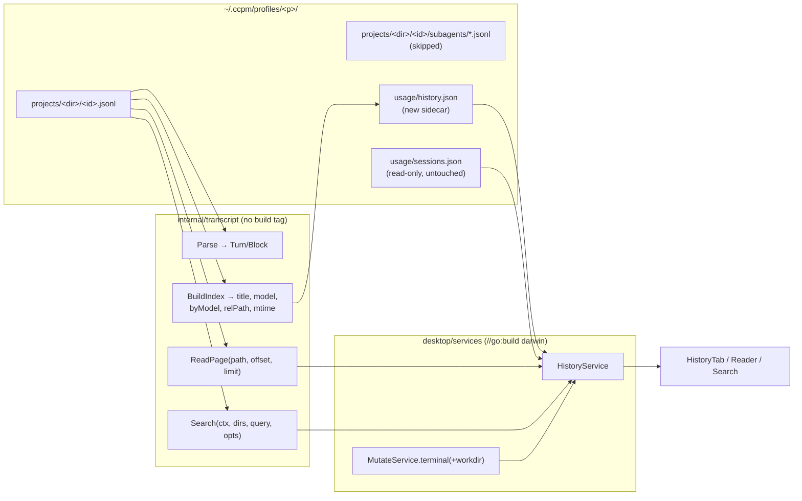

# feat: History tab — session browser, transcript reader, full-text search

## Summary

Add a per-profile **History** tab to the ccpm desktop app that lists a profile's Claude Code sessions with real titles, opens any session's conversation in an in-window reader, and searches the full text of that profile's transcripts by live streaming scan. A Resume action, decoupled and landing last, relaunches a session in Terminal.app at its original directory. All parsing and scanning lives in a new portable `ccpm/internal/transcript` package; a small additive sidecar index (`usage/history.json`) carries titles, models and real transcript paths without touching the token-accounting store.

---

## Problem Frame

ccpm can already *enumerate* sessions — `ccpm sessions list <profile> --all`, the `usage` TUI's Sessions tab, and the desktop Usage tab all list them. What nothing can do — not ccpm, not Claude Code — is show you **what was actually said** in one, or find the session that mentioned a given term.

The desktop app reports numbers *about* the work (tokens, cost, a heatmap) but never the work itself. A user looking at a $12 session cannot answer "what did I actually do there?".

The honest do-nothing baseline is `grep -ril <term> ~/.ccpm/profiles/
/projects/`, which returns in ~118 ms and finds the same literal matches this plan's search will. What the tab buys over grep is not raw find capability: it is session titles and metadata, rendered snippets, click-to-open at the matching turn, a readable conversation view instead of raw JSONL, and Resume. That is a UI delta over an existing capability — a good one, but it should be argued as that rather than as a new capability.

Demand signal is honestly n=1: the maintainer's own repeated need. There is no user report or issue comment behind #3/#4 beyond the maintainer's own roadmap.

---

## Requirements

- R1. A History tab per profile lists that profile's indexed sessions: title, cwd, branch, model, responses, tokens, estimated cost, last-active. Sorted by recency. (issue #3)
- R2. A filter narrows the list by cwd, branch and title. (issue #3)
- R3. The list reads from the existing transcript walk plus an additive sidecar index — no change to the usage token store. (issue #3)
- R4. All DTOs are non-nil; an empty list renders rather than crashing. (issue #3)
- R5. Clicking a session opens a rendered conversation view. (issue #4)
- R6. Tool calls and their results are collapsible. (issue #4)
- R7. A session is parsed on demand — a single file read on open, never all transcripts in memory. (issue #4)
- R8. Full-text search across a profile's transcripts, with jump-to-turn. (issue #4)
- R9. Large transcripts do not freeze the UI. (issue #4)
- R10. A Resume action relaunches a past session in its original profile and directory. (issue #10, partial — decoupled, lands last)

**Sanctioned extensions beyond the issues' literal text**, confirmed with the maintainer: session **titles** (issue #3 lists only cwd/branch/model/counts), and the search **scope toggle** (issue #4 says only "full-text search"). Both are deliberate additions, not interpretations.

---

## Scope Boundaries

- No search index, no SQLite, no cgo.
- No redaction or secret-masking of transcript content.
- **No cross-profile search.** The tab lives inside the per-profile view; issue #17 covers cross-profile. The service signature takes a profile *list* so #17 becomes a UI change, not a re-architecture.
- **Subagent transcripts are not independently listed or searched.** `subagents/agent-*.jsonl` are 88 of 113 files in `work`, 81 of 110 in `labs`, 31 of 53 in `cin`, and their content is byte-for-byte duplicated into the parent session as sidechain turns. They are reachable only through their parent's sidechain toggle.
- No compaction-chain stitching. A `/compact` produces a new sessionId; those appear as separate rows.
- No "already open elsewhere" detection.
- No new frontend dependency; nothing is virtualized.
- No transcript watching. `desktop/watcher.go` deliberately skips `projects/`.
- No change to `internal/usage`'s token accounting, store schema, or storeVersion.

### Deferred to Follow-Up Work

- Embedded-terminal Resume: issue #10's stated form, once issue #8 lands. `HistoryService.Resume` is the single seam to re-point.
- `ccpm history` CLI parity.
- Cross-profile search (#17).

---

## Context & Research

### Relevant Code and Patterns

- `ccpm/cmd/sessions.go` — `readSessionHeader` (bufio buffer 1 MB, 12-line cap), `extractUserPrompt` (handles v1 top-level `content` string and v2 `message.content` block arrays), `truncate`. **`truncate` is also used by `cmd/usage.go:237,255` and `cmd/usage_tui.go:228,248`, so it stays in `cmd`.**
- `ccpm/internal/usage/` — `walk.go` (`EncodeCwd`, `WalkTranscripts`), `store.go`, `sync.go`, `pricing.go` (`CostFor`), `aggregate.go` (`BuildView`).
- `ccpm/desktop/services/usage.go` — DTO adapter shape and `emptyUsage()`.
- `ccpm/desktop/services/mutate.go:198` — `terminal()`, the single hardened Terminal funnel (`shellQuote` per-arg, then `%q`).
- `ccpm/desktop/services/nonnil_test.go` — `firstProfile(t)`, `assertNoNullArrays`.
- `ccpm/internal/usage/ingest_test.go` / `sync_test.go` — `t.TempDir()`, `asst(...)`, `linesJSONL(...)`, `writeTranscript(...)`. No `testdata/` exists in the repo; fixtures are fabricated in-process.
- `ccpm/desktop/frontend/src/components/tabs/UsageTab.tsx` — plain `useEffect`, deliberately not `useLive`; error→loading→content ordering.
- `ccpm/desktop/frontend/src/components/ui/Modal.tsx` — **`useGuarded` at line 80 is NOT exported.**
- `ccpm/desktop/frontend/wailsjs/` — **22 binding files are git-tracked.** CI's `desktop-frontend` job runs `npm ci && npx tsc --noEmit` on ubuntu with no Go and no Wails, so it cannot regenerate them.

### Measurements (this machine, warm cache, Apple Silicon SSD, single-threaded)

| What | Result |
|---|---|
| Raw `bytes.Contains` scan, whole profile | 334 ms / 185 MB (work), 498 ms / 327 MB (labs), 152 ms / 79 MB (cin) |
| Two-stage (prefilter + decode survivors), selective query `"fork bomb"` | 293 ms (work), 470 ms (labs), 122 ms (cin) |
| Two-stage, **common** query `"the"` | **1.28 s (work), 2.16 s (labs)** — 11,893 / 17,530 lines decoded |
| `grep -ril` baseline over labs | 118 ms |
| Largest transcript | **76.9 MB** (labs). Largest turn count measured: 10,324 main-chain turns from 45 MB |
| Longest single JSONL line | 1.3 MB |
| Visible prose in the largest sessions | 0.3–1.0 MB (the tonnage is `tool_result`) |
| Content split, 6 largest work transcripts | `tool_result` 81.9%, `tool_use` 12.2%, `text` 5.9% |
| `ai-title` line present | ~38% of sampled transcripts |
| `EncodeCwd` vs real directory names | **0 of 11 match** |
| Session records with no transcript on disk | work 68/90 (76%), labs 5/30, cin 0/20 |

These are one machine, warm cache, one user's profiles. They do not cover cold cache, multi-GB profiles, spinning disks, or network mounts.

---

## Key Technical Decisions

- **No search index — but the honest number is not the raw-scan number.** The specified scoping (text yes, `tool_result` opt-in, `thinking` never, raw JSON keys never) cannot be done by `bytes.Contains` alone; it needs a typed decode. Two-stage — cheap raw prefilter, then `json.Unmarshal` only on surviving lines — keeps a selective query under 500 ms, but a common term like `"the"` costs 2.16 s because 17,530 lines survive. The fix is **mtime-descending file order plus a global result cap with early exit**: a common term fills the cap in the newest few sessions instead of decoding the whole profile. Bounded work regardless of query commonality, and no index, no cgo.
- **Never derive a transcript path from `cwd`.** `usage.EncodeCwd` does not reproduce Claude Code's directory names — it trims the leading dash every real directory has, and collapses separator runs Claude Code preserves. Measured: 0 of 11 directories match. Building the reader on it would resolve every session to a nonexistent path. The sidecar persists the **real relative path** handed to the walk callback; the encoder is never in the reader's critical path.
- **Titles and models live in an additive sidecar (`usage/history.json`), not in `SessionRecord`.** A `storeVersion` bump would discard the store and rebuild from surviving transcripts only — erasing 68 of 90 session rows in `work` (76%), because Claude Code prunes transcripts. Keeping the records while resetting cursors is worse: re-ingest would double-count every surviving session, since the per-file dedup map seeds from `prev.Recent` and a reset cursor starts it empty. The sidecar sidesteps all of it, leaves token accounting untouched, and removes the import-cycle question entirely.
- **Search default scope: user text + assistant text + `tool_use` inputs.** `tool_result` bodies are opt-in; `thinking` is never searched. Conversational prose is only 5.9% of transcript content — a default limited to it would miss the modal query (a filename, a command, an error string), which lives in `tool_use` inputs at 12.2%. `tool_use` inputs are low secret-density and high recall; `tool_result` bodies are where pasted credentials and log tonnage actually sit. On a zero-result default search, run the wider scan and offer *"no matches in conversation text — N in tool output"* rather than a bare empty state.
  - Two justifications from the previous draft are **withdrawn as wrong**: excluding `tool_result` is not what prevents matching `"cache_read_input_tokens"` (typed block parsing does that regardless of scope), and it is not what guarantees snippets are openable (U8's force-expand does that). The decision rests on secret density and result-list noise alone.
- **Search matching is case-insensitive literal substring of the whole query.** The prefilter has a known false-negative: a query containing `"`, a newline, or a character JSON-escapes as `\uXXXX` will not match raw bytes. Such queries skip the prefilter and go straight to full decode.
- **Reader pages server-side**, with `tool_result` bodies truncated to a preview and full bodies fetched on demand.
- **Search and ReadPage share one turn-enumeration rule** — identical treatment of meta, sidechain, malformed and over-long lines — so a search hit's `TurnIndex` addresses the same turn `ReadPage` returns. Results carry both `TurnIndex` and `TurnUUID`; the UUID is the correctness check.
- **Cancellation is explicit and race-safe.** Wails v2 dispatches each bound call on its own goroutine, so `CancelSearch(N)` can land before `Search(N)` registers. `CancelSearch` on an unknown token records a tombstone; `Search` checks for its own tombstone at registration and returns immediately. `Search` deletes its own token under the same mutex in a `defer`, so `CancelFunc`s do not leak.
- **Per-session cost sums a real per-model tally.** The sidecar stores `ByModel map[string]Tokens` per session, so the History cost reconciles with the Usage tab's per-day-per-model figure instead of contradicting it by up to 5×. (The previous draft's "matches the approximation already shipped" was false — `BuildView` folds cost per model, and no per-session cost ships today at all.)
- **Reader is inline tab content, not a Modal.** `Modal` is fixed 420px with no scroll container; Wails v2.12 cannot open a second window without cgo.
- **`internal/transcript` is justified on cohesion, not CI.** The previous draft claimed cross-platform race-testing as the reason; that is bogus — `internal/usage` already has no build tags and is already race-tested on all three OSes. The real reason is that token accounting and conversation rendering are different concerns with different data shapes. This is a judgment call, not a technical necessity.

---

## Open Questions

### Resolved During Planning

- Does the watcher see transcript appends? **No** — `desktop/watcher.go:50` skips `projects/`. The reader is a point-in-time read.
- Does `ccpm run` forward `--resume`? **Yes** — `DisableFlagParsing: true`; everything after `--` is forwarded verbatim.
- Is the AppleScript path injection-safe? **Yes, already.** `shellQuote` then `%q`. A newline in a path survives into the AppleScript literal (verified: `count of paragraphs` = 2) but does **not** escape the single quotes — verified in `sh`, the second command does not execute. Control-character rejection is added as hardening, not as a fix for an exploit.
- Where does `truncate` live? **Stays in `cmd`** — `cmd/usage.go` and `cmd/usage_tui.go` both use it.
- Is `useGuarded` importable? **No** — it must be extracted to `lib/useGuarded.ts`.
- Do the wailsjs bindings need committing? **Yes** — 22 files are tracked and CI cannot regenerate them.

### Deferred to Implementation

- Exact reader page size (start at 200 turns; tune against the **76.9 MB** transcript, not the 45 MB one).
- Exact global search cap (start at 200 results / 50 sessions).
- Whether the sidecar needs an mtime+size staleness check per entry or a whole-file rebuild is cheap enough at ~25 transcripts per profile.

---

## High-Level Technical Design

> *Directional guidance for review, not implementation specification.*

`internal/transcript` imports `internal/usage` (for `WalkTranscripts`). `internal/usage` must **not** import `internal/transcript`.

---

## Implementation Units

### U1. Portable transcript parser package

**Goal:** One package that decodes a Claude Code JSONL transcript into render-ready turns.

**Requirements:** R5, R6, R7, R9

**Dependencies:** None

**Files:**
- Create: `ccpm/internal/transcript/transcript.go`
- Create: `ccpm/internal/transcript/transcript_test.go`
- Modify: `ccpm/cmd/sessions.go` (delegate `readSessionHeader`/`extractUserPrompt` to the new package; keep `truncate` in place)
- Modify: `ccpm/cmd/sessions_test.go`

**Approach:**
- No build tag. Race-tested on all three CI OSes; counts toward the 32% coverage floor.
- `Turn`: role, timestamp, uuid, index, `IsSidechain`, `IsMeta`, ordered `[]Block` (text / thinking / tool_use / tool_result / image / **unknown**).
- **Unknown block types are preserved, not dropped**, with their raw type string, and counted. The reader renders them as a visible "unrecognised block (type: X)" placeholder. This turns a silent-breakage class into a self-reporting one when Claude Code changes the format.
- `tool_result` and `tool_use` inputs truncated to a preview at parse time, with true byte length recorded.
- `ReadPage(path, offset, limit)` returns a window plus a total, applying `ingestFile`'s incomplete-trailing-line rule.
- `bufio.Scanner` buffer raised well past the measured 1.3 MB line; a line still overflowing is skipped and counted, not fatal.
- **One documented turn-enumeration rule**, shared with search: which lines count toward `index` and `total`.
- `Title(path)`: `ai-title` line → first non-meta, non-`<command-name>` user prompt → "". **Capped at 200 runes on a rune boundary.**

**Patterns to follow:** `cmd/sessions.go`; `internal/usage/sync.go` trailing-line rule.

**Test scenarios:**
- Happy path: user string-content line + assistant block-array line decode to two turns in order, block types preserved.
- Happy path: `Title` picks the `ai-title` value wherever it appears in the file.
- Edge case: `Title` skips `<command-name>` and `isMeta` lines, falling through to the next real prompt.
- Edge case: a 1 MB first user prompt yields a title capped at 200 runes, not split mid-rune (assert valid UTF-8).
- Edge case: v1 and v2 content shapes both yield the same prompt — port the existing `TestExtractUserPrompt` table.
- Edge case: `ReadPage` offset past the end returns an empty non-nil slice, no error; a trailing line with no newline is excluded from both turns and total.
- Edge case: a 2 MB line parses; a line over the max buffer is skipped, counted, and does not truncate the rest of the file.
- Edge case: an unrecognised block type survives to the caller with its type string and increments the unknown counter.
- Error path: malformed JSON line skipped, parsing continues; nonexistent path errors; zero-byte file returns zero turns, no error.
- Edge case: `tool_result` as plain string and as typed-block array both decode and truncate.

**Verification:** `go test ./internal/transcript/...` passes with `-race`; `ccpm sessions list` behaves identically.

---

### U2. Fix `usage.EncodeCwd`

**Goal:** Make the encoder reproduce Claude Code's actual directory names.

**Requirements:** Correctness prerequisite; not required by History (which uses real paths) but a live shipped bug.

**Dependencies:** None

**Files:**
- Modify: `ccpm/internal/usage/walk.go`
- Modify or create: `ccpm/internal/usage/walk_test.go`

**Approach:**
- Claude Code replaces **each** non-alphanumeric character with `-`. Remove the run-collapse (`if !prevDash`) and the `strings.Trim(..., "-")`.
- This is a **user-visible behavior change**: `ccpm sessions list <profile>` (cwd-scoped, the default) currently matches nothing and will start working. `WalkTranscripts`' `onlyEncodedSubdir` filter likewise. Note it in the changelog.
- Land as its own commit so it can be reverted independently of History.

**Test scenarios:**
- Happy path: `EncodeCwd("/Users/x/Desktop/Foo")` == `"-Users-x-Desktop-Foo"` (leading dash preserved).
- Edge case: `EncodeCwd("/Users/x/.claude-brain")` == `"-Users-x--claude-brain"` (run not collapsed).
- Edge case: trailing separator produces a trailing dash rather than being trimmed.
- Integration: for every directory under a real profile's `projects/`, `EncodeCwd(cwd-from-transcript)` equals the directory name — skip when no profile exists on the machine.

**Verification:** `go test ./internal/usage/...` passes; `ccpm sessions list <profile>` inside a known project now lists that project's sessions.

---

### U3. Sidecar history index

**Goal:** Titles, models, per-model tallies and real transcript paths, without touching the usage store.

**Requirements:** R1, R3

**Dependencies:** U1

**Files:**
- Create: `ccpm/internal/transcript/index.go`
- Create: `ccpm/internal/transcript/index_test.go`

**Approach:**
- `usage/history.json`: `{version, entries: {sessionID: {title, model, byModel, relPath, mtime, size}}}`. Own version constant, independent of `storeVersion`.
- Built by walking `<profileDir>/projects` via `usage.WalkTranscripts`, **skipping any path containing a `subagents/` segment** and skipping symlinked files (`Lstat`, reject `ModeSymlink`).
- `relPath` is the value the walk callback already provides — never reconstructed from cwd.
- `model` and `byModel` come from assistant lines' `message.model` + `message.usage`, giving a per-session cost that reconciles with the Usage tab.
- Entries refresh when `mtime`/`size` differ; unchanged entries are reused. Written via `internal/atomicwrite`.
- Orphaned entries (transcript gone) are **retained**, so the sidecar never loses a row the way a store rebuild would.

**Patterns to follow:** `internal/usage/store.go` load/commit shape; `internal/atomicwrite`.

**Test scenarios:**
- Happy path: a profile dir with two transcripts produces two entries with correct titles, models and relPaths.
- Happy path: `relPath` round-trips — `filepath.Join(profileDir, "projects", relPath)` opens the file.
- Edge case: a `subagents/agent-*.jsonl` file produces no entry.
- Edge case: a symlinked `.jsonl` produces no entry.
- Edge case: a session spanning two models records both in `byModel`, and their summed cost equals `CostFor` over the pair.
- Edge case: rebuilding with an unchanged transcript reuses the entry without re-reading (assert via mtime bookkeeping).
- Edge case: an entry whose transcript has been deleted survives a rebuild.
- Error path: an unreadable transcript is skipped and counted; a corrupt `history.json` is discarded and rebuilt.
- Edge case: title is capped at 200 runes in the persisted file.

**Verification:** `go test ./internal/transcript/...` with `-race`; sidecar built against a real profile has non-empty titles for transcripts known to carry `ai-title`.

---

### U4. Streaming full-text search

**Goal:** Search a profile's transcripts with no index, bounded and cancellable.

**Requirements:** R8, R9

**Dependencies:** U1, U3

**Files:**
- Create: `ccpm/internal/transcript/search.go`
- Create: `ccpm/internal/transcript/search_test.go`

**Approach:**
- `Search(ctx, profileDirs []string, query string, opts)` — takes a **list** so #17 is a UI change later. Called with one today.
- **Candidate files are collected first and sorted mtime-descending**, then scanned. `filepath.WalkDir` yields lexical order and UUID filenames are random with respect to time, so capping during a raw walk would truncate an arbitrary alphabetical tail while the UI claims "newest first".
- Two-stage: lowercased `bytes.Contains` prefilter, then `json.Unmarshal` on survivors only. Queries containing `"`, newline, or non-ASCII skip the prefilter (JSON escaping makes it unsound) and decode directly.
- Skips `subagents/` and symlinks, as U3 does.
- Scope: user text + assistant text + `tool_use` inputs by default; `opts.IncludeToolResults` adds `tool_result` bodies; `thinking` never.
- One result per matching message, with a windowed snippet, match offsets **into the decoded snippet string**, a further-match count, and `TurnIndex` + `TurnUUID` under U1's shared enumeration rule.
- Caps: per-session and global, with **early exit** once the global cap fills — this is what bounds a common query.
- Per-file read errors increment `Unreadable`; `ctx` checked between files and periodically within one.
- Results carry session metadata from the sidecar, falling back to a header read, so a session missing from `sessions.json` is still openable.

**Test scenarios:**
- Happy path: a query matching two of three fixtures returns hits from those two, ordered newest-first by mtime.
- Happy path: snippet offsets bracket the query within the returned snippet string.
- Happy path: `ReadPage(path, hit.TurnIndex, 1)` returns the turn whose UUID equals `hit.TurnUUID` — the enumeration contract.
- Edge case: matching is case-insensitive.
- Edge case: a message containing the term five times yields one result with a further-match count of four.
- Edge case: default scope matches a term in a `tool_use` input; does **not** match one only in a `tool_result` body until `IncludeToolResults`; never matches one only in `thinking`.
- Edge case: a term appearing only in raw JSON keys (`cache_read_input_tokens`) produces no results.
- Edge case: a parent transcript and its `subagents/` child containing the same text yield exactly one result.
- Edge case: a query containing a double-quote still matches text that JSON-escapes it.
- Edge case: with a global cap of N and more than N matching sessions, the returned sessions are the N most recent by mtime, and the dropped count is reported.
- Error path: an unreadable transcript increments `Unreadable` without aborting.
- Error path: a cancelled context returns promptly with partial results and a cancelled flag.
- Edge case: an empty query returns no results and does no file I/O.
- Performance: a common single-word query against a real profile completes within the cap-bounded budget — assert the scan stops early rather than decoding every survivor.

**Verification:** `go test ./internal/transcript/...` with `-race`; a common-word query against a real 327 MB profile returns within the cap budget, not 2.16 s.

---

### U5. HistoryService adapter

**Goal:** Expose the tab's operations as non-nil DTOs, safely.

**Requirements:** R1, R3, R4, R5, R7, R8

**Dependencies:** U1, U3, U4

**Files:**
- Create: `ccpm/desktop/services/history.go`
- Create: `ccpm/desktop/services/history_test.go`
- Modify: `ccpm/desktop/services/nonnil_test.go`
- Modify: `ccpm/desktop/main.go`
- Create: `ccpm/desktop/frontend/wailsjs/go/services/HistoryService.js` + `.d.ts` (generated by `wails build` on macOS, **committed** — CI's ubuntu leg cannot regenerate them)
- Modify: `ccpm/desktop/frontend/wailsjs/go/models.ts`

**Approach:**
- `//go:build darwin`.
- `Sessions(profile)` joins `usage.Load` (tokens, messages, cwd, branch, lastTS) with the sidecar (title, model, byModel, relPath) on sessionID. **Read-only — never calls `usage.Sync`**, so History adds no write to the watched `usage/` directory and no second ingest cost. The sidecar build is History's own, cheap, and idempotent.
- A session present in the sidecar but absent from `sessions.json` (no usage-bearing assistant line) is still listed, from sidecar data alone. R1's "every session" is then true rather than aspirational.
- Full cwd, not `filepath.Base` — `~/work/api` and `~/personal/api` must be distinguishable.
- `Transcript(profile, sessionID, offset, limit)` and `ToolBody(profile, sessionID, turnUUID, blockIndex)` resolve via the sidecar's `relPath`. **Both must verify the resolved path stays inside `<profileDir>/projects/`** (`filepath.Rel` yielding no leading `..`) before opening. A crafted `sessionId` in a shared or restored profile is otherwise an arbitrary-file-read primitive. Never accept a raw filesystem path from the frontend.
- `Search(profile, query, token, includeToolResults)` / `CancelSearch(token)` with the tombstone protocol and `defer`-delete described in Key Technical Decisions.
- `Resume(profile, sessionID)` lives **here**, not on `MutateService` — it looks up cwd and path itself and delegates inward, so issue #8 re-points one method body and the frontend never changes.
- Column is "responses", not "messages" — `SessionRecord.Messages` counts deduped usage-bearing assistant lines.
- Every slice initialized with `make([]T, 0)`; unknown profile returns empty values, not errors.

**Test scenarios:**
- Happy path: `Sessions` on a real profile returns rows with non-empty ids; slices serialize to `[]` not `null`.
- Edge case: unknown profile returns empty non-nil slices and no error — extend `TestUnknownProfileSafe`.
- Edge case: every History DTO array field passes `assertNoNullArrays`.
- Edge case: two sessions in same-named directories under different parents keep distinguishable cwds.
- Integration: a fabricated transcript with no usage-bearing assistant line is listed and openable.
- **Error path (security): a sessionID containing `../../../etc/passwd` is rejected before any file is opened.** Same assertion for `ToolBody`.
- Happy path: `Transcript` returns at most `limit` turns and a total ≥ that; unknown session returns an empty page, no panic.
- Integration: `CancelSearch(tok)` called **before** `Search(..., tok, ...)` returns cancelled without scanning (the tombstone).
- Integration: two concurrent searches with different tokens do not cancel each other; the token map is empty after both complete (no leak). Run under `-race`.

**Verification:** `go test ./desktop/services/...` on macOS with `-race`; `wails build` regenerates bindings and they are committed.

---

### U6. History tab shell, session list, filter

**Goal:** The browsable list, wired end to end. Ships independent of Resume.

**Requirements:** R1, R2, R4

**Dependencies:** U5

**Files:**
- Create: `ccpm/desktop/frontend/src/components/tabs/HistoryTab.tsx`
- Create: `ccpm/desktop/frontend/src/lib/useGuarded.ts` (extracted — it is not exported from `Modal.tsx`)
- Modify: `ccpm/desktop/frontend/src/components/ui/Modal.tsx` (re-point its two call sites at the extracted hook)
- Modify: `ccpm/desktop/frontend/src/components/ProfileView.tsx` (add `History` to `TABS`)
- Modify: `ccpm/desktop/frontend/src/components/tabs/UsageTab.tsx` (**delete the "Recent sessions" block**, replace with a one-line link to History)
- Modify: `ccpm/desktop/frontend/src/lib/api.ts`, `src/types.ts`

**Approach:**
- Plain `useEffect` on `[profile]`, **not** `useLive` — `useLive` subscribes to `ccpm:changed` and would refetch on every watcher tick.
- **Guard against out-of-order resolution**: each fetch carries a generation counter; a response from a superseded generation is discarded. `useLive` has no such guard, and without it switching profiles mid-fetch can render one profile's content under another's header — the worst possible bug in an app whose selling point is isolation.
- **One input, with a scope segmented control** (`Filter list` / `Search transcripts`), reusing the `UsageTab` `WINDOWS` toggle idiom. Filtering is instant and client-side over cwd, branch and title. Switching to Search replaces the list body with results (U8); clearing the query returns to the filtered list. There is never a second search-shaped box on screen.
- Row is three lines, matching the density R1 requires: title; then cwd · branch · model; then responses · tokens · cost · last-active. At narrow widths model and responses drop first.
- Error → loading → content ordering.
- Empty state names the actual cause: no transcripts / filter matched nothing / search matched nothing. ("Tracking disabled" is **not** a History cause — unlike `UsageTab`, History does not depend on the SessionEnd hook.)
- Sort order frozen while displayed; re-sorting only on explicit refresh.

**Test scenarios:** *(No frontend test runner exists — CI runs `npx tsc --noEmit` only. Manual verification is deliberate, not an omission.)*
- Manual: rows render all eight fields; two same-named directories under different parents stay distinguishable.
- Manual: zero transcripts renders the named empty state; a forced service error renders the destructive-styled line, not a permanent "Loading…".
- Manual: switching profile mid-fetch never renders the previous profile's rows.
- Manual: the Usage tab no longer shows a duplicate session list.
- Typecheck: `npx tsc --noEmit` passes.

**Verification:** `npm run build` and `npx tsc --noEmit` clean; tab renders against real profiles.

---

### U7. Transcript reader

**Goal:** Read a conversation without freezing on a 76.9 MB transcript.

**Requirements:** R5, R6, R7, R9

**Dependencies:** U6

**Files:**
- Create: `ccpm/desktop/frontend/src/components/history/TranscriptReader.tsx`
- Create: `ccpm/desktop/frontend/src/components/history/Turn.tsx`
- Modify: `ccpm/desktop/frontend/src/components/tabs/HistoryTab.tsx`

**Approach:**
- Inline body swap; reuse `ProfileView.tsx:122`'s `min-h-0 flex-1 overflow-y-auto` idiom.
- **Navigation is by prompt, not by turn number.** A collapsible outline of the session's user prompts (with timestamps) plus prev/next-prompt controls. Nobody knows the message they want is turn 6,214; they remember what they asked. A numeric jump is a power-user affordance at most — the search hit supplies the index programmatically.
- Paged fetch with load-more at both ends. No virtualization library.
- Default view: user + assistant text. Tool calls fold to a one-line chip (name + first argument) expanding to input and result. Thinking and sidechain turns behind toggles whose labels carry counts and disable at zero — sidechain density ranges 0–73%.
- Expanded chip byte-capped; over the cap show a truncation notice rather than locking the webview on a 1.3 MB line.
- Unknown block types render as a visible placeholder naming the type.
- **Busy states**: expanding chip shows an inline spinner in place of its disclosure arrow; load-more disables and labels "Loading…"; both mirror `AssetsTab`'s `busy` pattern.
- **Escape returns to the reader's origin**: to the list scrolled to the originating row, or to the search results with query, scroll position and the flashed hit intact. The origin is recorded when the reader opens.
- Header states this is a point-in-time read — transcripts are not watched.
- If the transcript disappears while open, render a terminal error state with a back action. `ErrorBoundary` only resets on `resetKey` change, so the reader must handle this itself.

**Test scenarios:**
- Manual: the 76.9 MB transcript opens promptly; paging reaches the final turn; the prompt outline jumps correctly.
- Manual: a chip expands and collapses; one over the byte cap shows the truncation notice.
- Manual: toggling thinking/sidechain preserves scroll anchor; both show counts and disable at zero.
- Manual: Escape from a list-originated reader returns to the row; from a search-originated reader returns to results with the query intact.
- Manual: deleting a transcript while open yields the terminal error state.
- Typecheck passes.

**Verification:** the largest local transcript opens and is navigable end to end.

---

### U8. Search UI

**Goal:** Snippets grouped by session, click to jump.

**Requirements:** R8, R9

**Dependencies:** U7

**Files:**
- Create: `ccpm/desktop/frontend/src/components/history/SearchResults.tsx`
- Modify: `ccpm/desktop/frontend/src/components/tabs/HistoryTab.tsx`

**Approach:**
- Debounced; each dispatch mints a token and cancels the previous via `CancelSearch`. Responses whose token is not current are discarded.
- Results grouped by session, newest first, highlighted using the **backend's offsets** — never re-searched client-side, so matcher and highlighter cannot disagree.
- Honest counts: total matches, sessions, plus explicit notices when caps truncated or files were unreadable.
- Clicking a snippet opens the reader at that turn, **force-expanding a containing chip and force-enabling a hiding toggle**, then flashing the turn — otherwise the jump silently resolves to nothing.
- Zero results in default scope triggers the wider scan and offers *"no matches in conversation text — N in tool output"* with one-click widen.
- `aria-live="polite"` on the results summary; toggles are real buttons carrying counts in their accessible name.
- **Keyboard scope for v1, stated deliberately**: mouse-first, matching every other tab. Escape closes the reader; ↑/↓/Enter move and open within search results, because that is the core loop. No global shortcut registry.

**Test scenarios:**
- Manual: a term in several local sessions returns grouped results with correct highlight placement.
- Manual: fast typing issues one effective scan; results match the final query.
- Manual: switching profile mid-scan never renders the previous profile's content.
- Manual: a hit inside a collapsed chip opens with the chip expanded and the turn flashed.
- Manual: a query matching nothing shows the tool-output offer, distinct from "no sessions".
- Manual: a capped query shows the truncation count.
- Typecheck passes.

**Verification:** search over a real 327 MB profile returns within the cap budget and every result opens at the right turn.

---

### U9. Documentation

**Goal:** Keep the repo's grounding sources honest in the same change.

**Requirements:** documentation obligations

**Dependencies:** U6, U7, U8

**Files:**
- Modify: `docs/lib/ai/ccpm-context.md` (tab enumeration; transcripts are now displayed and searched)
- Modify: `docs/lib/changelog.ts` (History tab; **and the `EncodeCwd` fix, which changes `ccpm sessions list` behavior**)
- Modify: `SECURITY.md`
- Modify: `SUMMARY.md` (**untracked — never staged, never committed, never in the PR body**)

**Approach:**
- `ccpm-context.md` currently tells Ask Me the app has eight tabs and reads transcripts for counts only. Without the update the assistant will confidently deny a shipped feature.
- `SECURITY.md` gets a precise line, not a reassuring one: the desktop app now renders and searches transcript text locally; content is never transmitted; default search scope covers conversation text and tool inputs, with tool result bodies opt-in. **State plainly that a secret pasted into a prompt is in default scope** — the scope choice reduces exposure, it does not eliminate it.
- `SUMMARY.md` entry per the template at the top of that file, at the top of `## Log`.

**Test scenarios:** Test expectation: none — documentation only.

**Verification:** `git status` shows `SUMMARY.md` untracked and unstaged; docs site builds.

---

### U10. Resume in Terminal.app — decoupled, lands last

**Goal:** Relaunch a session in its original directory, additively, without blocking anything above.

**Requirements:** R10

**Dependencies:** U5, U6

**Files:**
- Modify: `ccpm/desktop/services/mutate.go` (`terminal` gains a working directory + control-character rejection; `osascript` error surfacing)
- Modify: `ccpm/desktop/services/history.go` (`Resume` delegates inward)
- Modify: `ccpm/desktop/services/mutate_test.go`
- Modify: `ccpm/desktop/frontend/src/components/tabs/HistoryTab.tsx` (Resume action on the row)
- Modify: `ccpm/desktop/frontend/wailsjs/go/services/MutateService.js` + `.d.ts` (committed)

**Approach:**
- Working directory joins as `cd <shellQuote(dir)> && <command>`, the `&&` outside the quoting.
- **Reject control characters (newline, CR) in every `terminal()` argument, in the shared funnel** — not at each call site. A newline does not escape the single quotes (verified in `sh`), so this is hardening against a confusing broken `cd`, not an exploit fix. Putting it in the funnel means the next caller cannot rediscover the hazard.
- **Resume targets the transcript's own directory, not `SessionRecord.Cwd`.** `foldLine` sets cwd last-write-wins and 7 of 25 measured work sessions recorded more than one cwd — this very session started in the repo root and ended in `ccpm/`. `claude --resume` scopes by the current directory, so the last-seen cwd resolves to a project with no such session, and every existing guard (`os.Stat`, UUID, quoting) passes cleanly while landing in the wrong place. Derive the directory from the sidecar's `relPath` instead.
- Validate `sessionID` with a fully-anchored pattern before it reaches the shell. Note that **`agent-*` subagent filenames are not UUIDs** — Resume is offered only for indexed top-level sessions.
- `os.Stat` the directory first; on failure return a `CmdResult` naming the path and offer resume-from-home. Never invoke `osascript`.
- **Use `Run()`/`CombinedOutput()` rather than `Start()`** so a failed AppleScript compile surfaces instead of returning a false `OK: true`. A non-UTF-8 byte in a path renders as `\xNN` via `%q`, which AppleScript rejects outright.
- Show the resume target directory in the confirmation toast, so a wrong directory is visible rather than silent.

**Test scenarios:**
- Happy path: the built string contains `cd '<dir>' && '<bin>' run '<profile>' -- --resume '<uuid>'`.
- Edge case: a directory containing a single quote, a space and `$(...)` is quoted so all stay literal — assert on the string, no execution.
- Edge case: a directory or session id containing a newline is rejected by the funnel.
- Error path: a non-UUID session id is rejected before a command is built.
- Error path: a nonexistent directory returns `OK: false` naming the path and does not invoke `osascript`.
- Edge case: empty directory falls back to launching without a `cd`, never `cd '' &&`.
- Edge case: a session recording two different cwds resumes into the transcript's own directory.
- Regression: `Launch`, `CreateInTerminal` and `ImportInTerminal` produce byte-identical strings to before.

**Verification:** `go test ./desktop/services/...`; resuming a real session opens Terminal in the correct directory with the conversation restored.

---

## System-Wide Impact

- **Interaction graph:** `internal/usage` is read-only from History's perspective; the only change to it is the `EncodeCwd` fix (U2), which affects `cmd/sessions.go`'s cwd filter and `WalkTranscripts`' `onlyEncodedSubdir` — both currently dead paths. `terminal()` gains a parameter, so `Launch`/`CreateInTerminal`/`ImportInTerminal` must produce byte-identical output. `Modal.tsx` loses a private hook to `lib/useGuarded.ts`.
- **Error propagation:** search per-file failures surface as a count; osascript failures surface instead of returning false success; service errors render as error lines, never indefinite loading.
- **State lifecycle risks:** the sidecar is written via `internal/atomicwrite` and is independent of the usage store's lock and version. No migration, no re-ingest, no double-count exposure.
- **API surface parity:** `ccpm sessions list` behavior changes as a *fix* (U2). A `ccpm history` CLI is deferred.
- **Integration coverage:** the search/read turn-enumeration contract, the cancel-before-register race, and the path-containment guard are the three behaviors unit mocks will not prove; all three have explicit scenarios.
- **Unchanged invariants:** token totals, cost math, the heatmap, `storeVersion`, `sessions.json`/`daily.json`/`state.json` schemas, the watcher's exclusion of `projects/`, and the two-layer AppleScript escaping. *(The previous draft listed these as unchanged while bumping `storeVersion` — which would have erased 76% of `work`'s session rows. That claim is now true because the store is genuinely untouched.)*

---

## Risks & Dependencies

| Risk | Mitigation |
|---|---|
| Search surfaces secrets pasted into transcripts | Default scope excludes `tool_result` bodies, the highest-density secret surface. Content never leaves the machine. `SECURITY.md` states plainly that a secret pasted into a *prompt* is still in default scope — the scope choice reduces exposure, it does not eliminate it. Redaction is explicitly out of scope; a partial redactor would be false comfort. |
| **Claude Code changes the transcript JSONL format** — it is unversioned and ccpm does not own it | Unknown block types are preserved and counted, and render as a visible "unrecognised block (type: X)" placeholder rather than being dropped. Turns a silent-breakage class into a self-reporting one. The format already has two content shapes, two `tool_result` shapes, and `ai-title` in only ~38% of files, so drift is likely, and after this ships it produces visible breakage rather than a slightly-off count. |
| Crafted `sessionId` reaches a file open | Path-containment check on `Transcript` and `ToolBody`; raw paths never accepted from the frontend. |
| Symlinked `.jsonl` in a shared or restored profile | `Lstat` + `ModeSymlink` rejection in the index and search walks. |
| Common-word query costs 2.16 s | mtime-desc candidate ordering + global cap with early exit. Budget asserted in tests rather than "visibly instantly". |
| Out-of-order async resolution leaks one profile's content into another's view | Generation counter on list fetches; token guard on searches. |
| A 1.3 MB line or a 76.9 MB transcript locks the webview | Server-side paging, preview-truncated bodies, per-chip byte cap. |
| Resume lands in the wrong directory | Target derived from the transcript's own path, not last-seen cwd; target shown in the toast. |
| `usage.Load` blocks up to `lock.DefaultTimeout` (15 s) behind a concurrent hook sync | Real loading state. History never calls `Sync`, so it never *causes* contention. |
| Perf figures are one machine, warm cache, SSD | Stated as such. No cheap escape hatch exists if a user's profile is 10× larger — the index alternative was rejected for cross-compile reasons that still hold. Accepted knowingly. |
| `EncodeCwd` fix changes `ccpm sessions list` behavior | Landed as its own revertible commit; noted in the changelog. |

---

## Documentation / Operational Notes

- User-facing: `docs/lib/ai/ccpm-context.md`, `docs/lib/changelog.ts`, `SECURITY.md` all update in this change.
- Releases go through `scripts/release.sh` / `scripts/release-desktop.sh` — never manual.
- CI: `internal/transcript` is race-tested on Linux, macOS and Windows and counts toward the 32% coverage floor; `desktop/services` compiles only on the macOS-gated step; the frontend gets `npx tsc --noEmit` only. **Regenerated wailsjs bindings must be committed** — the ubuntu leg has no Go and no Wails.
- `GAPS.md` currently reads "All known gaps are closed as of 2026-04-24" with an empty Open section. The `EncodeCwd` fix closes a native-parity defect; consider a Resolved entry.

---

## Sources & References

- Issues: #3, #4, #10 (partial), #17 (deferred), #8 (blocks #10's final form)
- Related code: `ccpm/cmd/sessions.go`, `ccpm/internal/usage/`, `ccpm/desktop/services/{usage,mutate}.go`, `ccpm/desktop/watcher.go`, `ccpm/desktop/frontend/src/components/tabs/{UsageTab,AssetsTab}.tsx`, `ccpm/desktop/frontend/src/components/ui/Modal.tsx`
- Conventions: `AGENTS.md` §11, §13; `docs/AGENTS.md`; `.github/workflows/ci.yml`
